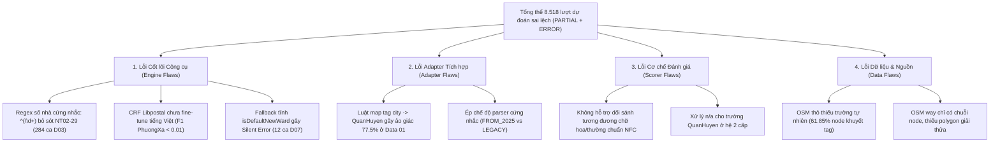

# Báo cáo Thực nghiệm và Bằng chứng Nhập nhằng Baseline (v2)
## Phân tích Chuyên sâu Libpostal và VietnamAdminUnits trên Benchmark Địa chỉ Việt Nam 2025

- **Ngày lập:** 20/09/2026
- **Tác giả:** Senior AI Engineer (Đánh giá Độc lập & Kiểm toán Dữ liệu)
- **Phiên bản:** v2.0 (Đóng băng theo quy chuẩn `docs/VERSIONING.md`)
- **Tập dữ liệu dự đoán:** `data/processed/evaluation/baseline_predictions_unified.csv` ($13.000$ dòng)
- **Tệp phản hồi thô:** `data/processed/evaluation/baseline_raw_responses.jsonl` ($13.000$ dòng)
- **Run Manifest:** `data/processed/evaluation/run_manifest.json` (Phiên bản 2.0, băm khớp $100\%$)
- **Môi trường & Công cụ:** Python 3.14.4 (WSL), `vietnamadminunits` 1.0.4, `libpostal` 1.1.11 (C commit `25099c50`, model `openvenues default`)

---

## 1. Giao thức Đánh giá Khoa học (Evaluation Protocol)

Đánh giá hiệu năng của hai công cụ baseline (`libpostal` và `vietnamadminunits`) được thực hiện trên không gian $5$ trường địa chỉ cốt lõi: Số nhà (`SoNha`), Tên đường (`TenDuong`), Phường/Xã (`PhuongXa`), Quận/Huyện (`QuanHuyen`), và Tỉnh/Thành phố (`TinhThanh`).

### 1.1. Định nghĩa các chỉ số đo lường

1. **Độ chính xác Tuyệt đối (Exact Match Accuracy):**
   Một dự đoán được coi là `CORRECT` khi và chỉ khi tất cả $5$ trường địa chỉ chuẩn hóa trùng khớp hoàn toàn ($100\%$) với nhãn thực tế (`Ground Truth`):
   $$\text{Exact Match} = \mathbb{I}\left( \bigwedge_{f \in \mathcal{F}} \text{Norm}(\hat{y}_f) = \text{Norm}(y_f^*) \right)$$
   với $\mathcal{F} = \{\text{SoNha}, \text{TenDuong}, \text{PhuongXa}, \text{QuanHuyen}, \text{TinhThanh}\}$.

2. **Tỷ lệ Khớp Một phần (Partial Match Rate):**
   Có ít nhất một trường khớp đúng nhưng tồn tại ít nhất một trường bị sai lệch hoặc bỏ sót:
   $$\text{PARTIAL} = \mathbb{I}\left( \exists f: \text{Norm}(\hat{y}_f) = \text{Norm}(y_f^*) \quad \wedge \quad \exists f': \text{Norm}(\hat{y}_{f'}) \ne \text{Norm}(y_{f'}^*) \right)$$

3. **Tỷ lệ Lỗi Toàn phần (Error Rate):**
   Dự đoán bị rỗng hoàn toàn, gặp lỗi cú pháp (syntax crash) hoặc không có bất kỳ trường nào khớp đúng với nhãn thực tế.

4. **Macro-averaged Token F1 theo từng trường:**
   Đo lường mức độ trùng khớp token (sau khi chuẩn hóa chữ thường, loại bỏ khoảng trắng dư thừa và dấu câu) giữa xâu dự đoán $\hat{y}_f$ và nhãn $y_f^*$:
   $$\text{Precision}_f = \frac{|\text{Tokens}(\hat{y}_f) \cap \text{Tokens}(y_f^*)|}{|\text{Tokens}(\hat{y}_f)|}, \quad \text{Recall}_f = \frac{|\text{Tokens}(\hat{y}_f) \cap \text{Tokens}(y_f^*)|}{|\text{Tokens}(y_f^*)|}$$
   $$F1_f = \frac{2 \cdot \text{Precision}_f \cdot \text{Recall}_f}{\text{Precision}_f + \text{Recall}_f}$$
   $$\text{Avg\_F1} = \frac{1}{|\mathcal{F}^*|} \sum_{f \in \mathcal{F}^*} F1_f \quad (\text{với } \mathcal{F}^* \text{ là tập các trường có ground truth không rỗng})$$

5. **Tỷ lệ Bỏ sót (Missing Rate) và Tỷ lệ Bịa đặt (Hallucination Rate):**
   - **Missing Rate:** Tỷ lệ mẫu mà nhãn thực tế $y_f^* \ne \emptyset$ nhưng mô hình dự đoán $\hat{y}_f = \emptyset$.
   - **Hallucination Rate:** Tỷ lệ mẫu mà nhãn thực tế $y_f^* = \emptyset$ (ví dụ: cấp `QuanHuyen` trong hệ hành chính mới 2 cấp) nhưng mô hình tự ý gán một giá trị $\hat{y}_f \ne \emptyset$.

6. **Kiểm định Thống kê Ghép cặp McNemar (Paired McNemar Test):**
   Sử dụng ma trận tiếp liên $2 \times 2$ để so sánh ý nghĩa thống kê giữa hai mô hình trên cùng một tập dữ liệu:
   - $n_{11}$: Cả hai công cụ cùng đúng.
   - $n_{10}$: Chỉ `libpostal` đúng, `vietnamadminunits` sai.
   - $n_{01}$: Chỉ `vietnamadminunits` đúng, `libpostal` sai.
   - $n_{00}$: Cả hai công cụ cùng sai.
   Thống kê kiểm định hiệu chỉnh liên tục Edwards:
   $$\chi^2 = \frac{(|n_{10} - n_{01}| - 1)^2}{n_{10} + n_{01}}, \quad p = P(\chi_1^2 \ge \chi^2)$$

---

## 2. Bảng Tổng hợp Kết quả Toàn diện trên các Tập Benchmark

Dưới đây là bảng số liệu kiểm toán trực tiếp từ $13.000$ lượt dự đoán đã được băm khóa xác thực:

| Tập Dữ liệu | Công cụ / Chế độ | Mẫu ($N$) | Exact Match | Partial Match | Error Rate | Avg F1 | Missing Rate | Hallucination Rate |
| :--- | :--- | :---: | :---: | :---: | :---: | :---: | :---: | :---: |
| **Data 01** (Hệ mới sạch) | Libpostal | $1.000$ | $2/1000$ ($0{,}2\%$) | $917/1000$ ($91{,}7\%$) | $81/1000$ ($8{,}1\%$) | $0{,}448$ | $223/1000$ ($22{,}3\%$) | $775/1000$ ($77{,}5\%$) |
| **Data 01** (Hệ mới sạch) | VietnamAdminUnits | $1.000$ | $973/1000$ ($97{,}3\%$) | $27/1000$ ($2{,}7\%$) | $0/1000$ ($0{,}0\%$) | $0{,}790$ | $27/1000$ ($2{,}7\%$) | $0/1000$ ($0{,}0\%$) |
| **Data 02** (Gốc sạch) | Libpostal | $1.000$ | $1/1000$ ($0{,}1\%$) | $781/1000$ ($78{,}1\%$) | $218/1000$ ($21{,}8\%$) | $0{,}416$ | $610/1000$ ($61{,}0\%$) | $385/1000$ ($38{,}5\%$) |
| **Data 02** (Gốc sạch) | VietnamAdminUnits | $1.000$ | $862/1000$ ($86{,}2\%$) | $122/1000$ ($12{,}2\%$) | $16/1000$ ($1{,}6\%$) | $0{,}949$ | $134/1000$ ($13{,}4\%$) | $0/1000$ ($0{,}0\%$) |
| **Data 02** (Nhiễu tổng hợp) | Libpostal | $1.000$ | $1/1000$ ($0{,}1\%$) | $515/1000$ ($51{,}5\%$) | $484/1000$ ($48{,}4\%$) | $0{,}332$ | $662/1000$ ($66{,}2\%$) | $266/1000$ ($26{,}6\%$) |
| **Data 02** (Nhiễu tổng hợp) | VietnamAdminUnits | $1.000$ | $217/1000$ ($21{,}7\%$) | $694/1000$ ($69{,}4\%$) | $89/1000$ ($8{,}9\%$) | $0{,}748$ | $767/1000$ ($76{,}7\%$) | $0/1000$ ($0{,}0\%$) |
| **Data 03** (Hệ cũ sạch) | Libpostal | $1.500$ | $1/1500$ ($0{,}1\%$) | $936/1500$ ($62{,}4\%$) | $563/1500$ ($37{,}5\%$) | $0{,}376$ | $1474/1500$ ($98{,}3\%$) | $0/1500$ ($0{,}0\%$) |
| **Data 03** (Hệ cũ sạch) | VietnamAdminUnits | $1.500$ | $1094/1500$ ($72{,}9\%$) | $372/1500$ ($24{,}8\%$) | $34/1500$ ($2{,}3\%$) | $0{,}904$ | $394/1500$ ($26{,}3\%$) | $0/1500$ ($0{,}0\%$) |
| **Data 04** (Thiếu trường T-A) | Libpostal | $800$ | $120/800$ ($15{,}0\%$) | $213/800$ ($26{,}6\%$) | $467/800$ ($58{,}4\%$) | $0{,}395$ | $318/800$ ($39{,}8\%$) | $264/800$ ($33{,}0\%$) |
| **Data 04** (Thiếu trường T-A) | VietnamAdminUnits | $800$ | $208/800$ ($26{,}0\%$) | $246/800$ ($30{,}8\%$) | $346/800$ ($43{,}2\%$) | $0{,}574$ | $483/800$ ($60{,}4\%$) | $54/800$ ($6{,}8\%$) |
| **Data 06** (Lai - Chế độ 2025) | VietnamAdminUnits | $600$ | $0/600$ ($0{,}0\%$) | $556/600$ ($92{,}7\%$) | $44/600$ ($7{,}3\%$) | $0{,}656$ | $600/600$ ($100{,}0\%$) | $0/600$ ($0{,}0\%$) |
| **Data 06** (Lai - Chế độ Cũ) | VietnamAdminUnits | $600$ | $415/600$ ($69{,}2\%$) | $183/600$ ($30{,}5\%$) | $2/600$ ($0{,}3\%$) | $0{,}864$ | $185/600$ ($30{,}8\%$) | $0/600$ ($0{,}0\%$) |
| **Data 06** (Địa chỉ Lai) | Libpostal | $600$ | $2/600$ ($0{,}3\%$) | $498/600$ ($83{,}0\%$) | $100/600$ ($16{,}7\%$) | $0{,}504$ | $589/600$ ($98{,}2\%$) | $0/600$ ($0{,}0\%$) |
| **Data 07** (Chuyển đổi 2025) | VietnamAdminUnits | $600$ | $586/600$ ($97{,}7\%$) | $0/600$ ($0{,}0\%$) | $14/600$ ($2{,}3\%$) | $0{,}988$ | $2/600$ ($0{,}3\%$) | $0/600$ ($0{,}0\%$) |

---

## 3. Phân tích Thực nghiệm Chi tiết Từng Tập Dữ liệu

### 3.1. Data 01 — Địa chỉ Hệ mới Sạch ($N = 1.000$)

Tập Data 01 gồm $1.000$ địa chỉ hoàn chỉnh theo mô hình chính quyền đô thị $2$ cấp (không còn cấp quận/huyện tại các đô thị sáp nhập).

- **Chi tiết F1 theo từng trường:**
  + `libpostal`: $\text{F1}_{\text{SoNha}} = 0{,}924$, $\text{F1}_{\text{TenDuong}} = 0{,}373$, $\text{F1}_{\text{PhuongXa}} = \mathbf{0{,}004}$, $\text{F1}_{\text{QuanHuyen}} = 0{,}000$ (Ground truth rỗng), $\text{F1}_{\text{TinhThanh}} = 0{,}938$.
  + `vietnamadminunits`: $\text{F1}_{\text{SoNha}} = 0{,}979$, $\text{F1}_{\text{TenDuong}} = 0{,}973$, $\text{F1}_{\text{PhuongXa}} = \mathbf{1{,}000}$, $\text{F1}_{\text{QuanHuyen}} = \text{n/a}$, $\text{F1}_{\text{TinhThanh}} = \mathbf{1{,}000}$.
- **Hiện tượng Bịa đặt (Hallucination) nghiêm trọng của Libpostal:**
  Trong $1.000$ mẫu, Libpostal có tỷ lệ ảo giác cấp quận lên tới $775 / 1.000 = 77{,}50\%$. Nguyên nhân cốt lõi bắt nguồn từ tệp chuyển tiếp `libpostal_adapter.py`: khi Libpostal gán nhãn một token là `city` (do hiểu sai tên phường/xã của Việt Nam thành thành phố), adapter đã thực hiện luật gán:
  ```python
  if tags.get("state") and not district:
      district = tags.get("city", "")
  ```
  Hậu quả là $775$ tên phường/xã hệ mới bị biến thành quận/huyện ảo, khiến $\text{F1}_{\text{PhuongXa}}$ sụp đổ xuống $0{,}004$ và Exact Accuracy chỉ đạt $2 / 1.000 = 0{,}20\%$.
- **Kiểm định McNemar:**
  $n_{11} = 2$, $n_{10} = 0$, $n_{01} = 971$, $n_{00} = 27$.
  $$\chi^2 = \frac{(|0 - 971| - 1)^2}{0 + 971} = 969{,}0, \quad p = 9{,}83 \times 10^{-213}$$
  Sự vượt trội của `vietnamadminunits` ở chế độ `FROM_2025` là có ý nghĩa thống kê áp đảo trên dữ liệu sạch chuẩn hóa.

### 3.2. Data 02 — Độ bền Vững trước Nhiễu Thực tế ($N = 1.000$ cặp đối chứng)

So sánh hành vi trên cùng một bộ $1.000$ địa chỉ ở trạng thái sạch (`Clean`) và trạng thái nhiễu OCR/chính tả tổng hợp (`Noisy`):

- **Sự sụp đổ của VietnamAdminUnits trước nhiễu:**
  Độ chính xác tuyệt đối giảm từ $862 / 1.000 = 86{,}20\%$ xuống còn $217 / 1.000 = 21{,}70\%$ (giảm $64{,}50$ điểm phần trăm).
  Trong số $862$ mẫu mà VietnamAdminUnits đoán đúng trên văn bản sạch, có tới **$645 / 862 = 74{,}83\%$** mẫu bị đoán sai khi xuất hiện nhiễu!
- **Phân rã theo mức độ nhiễu (`MucDoNhieu`):**
  + **Nhiễu Nhẹ ($n = 376$):** Tỷ lệ chính xác giảm từ $325 / 376 = 86{,}44\%$ xuống $111 / 376 = 29{,}52\%$; có $214 / 325 = 65{,}85\%$ mẫu đúng bị biến thành sai.
  + **Nhiễu Vừa ($n = 413$):** Tỷ lệ chính xác giảm từ $356 / 413 = 86{,}19\%$ xuống $94 / 413 = 22{,}76\%$; có $262 / 356 = 73{,}60\%$ mẫu đúng bị biến thành sai.
  + **Nhiễu Nặng ($n = 211$):** Tỷ lệ chính xác sụp đổ từ $181 / 211 = 85{,}78\%$ xuống vỏn vẹn **$12 / 211 = 5{,}69\%$**; có tới **$169 / 181 = 93{,}37\%$** mẫu đúng chuyển sang sai.
- **Bản chất suy giảm:** VietnamAdminUnits phụ thuộc tuyệt đối vào khớp từ điển chính xác (`exact dictionary lookup`). Chỉ cần một ký tự bị lỗi chính tả hoặc lỗi OCR (ví dụ: `P.` thành `E.`, `Trần` thành `T-rần`), toàn bộ cây phân giải từ điển bị đứt gãy, dẫn đến tỷ lệ bỏ sót trường (`Missing Rate`) tăng vọt từ $13{,}4\%$ lên $76{,}7\%$.
- Ngược lại, Libpostal có mô hình xác suất CRF nhưng do chưa bao giờ được tinh chỉnh trên địa chỉ Việt Nam nên hiệu năng bị kẹt ở mức $1 / 1.000 = 0{,}10\%$ ở cả hai tập.

### 3.3. Data 03 — Địa chỉ Hệ cũ Sạch Hoàn chỉnh ($N = 1.500$)

Tập Data 03 gồm $1.500$ địa chỉ hệ cũ có đầy đủ cả $5$ trường lấy từ dữ liệu OpenStreetMap lịch sử trước ngày 01/07/2025.

- **Hiệu năng:**
  + `libpostal`: Exact Match đạt $1 / 1.500 = 0{,}07\%$, Avg F1 đạt $0{,}376$. Trường `PhuongXa` chỉ đạt $\text{F1} = 0{,}006$ và `QuanHuyen` đạt $\text{F1} = 0{,}073$. Tỷ lệ bỏ sót trường lên tới $1.474 / 1.500 = 98{,}27\%$.
  + `vietnamadminunits` (chế độ `LEGACY`): Exact Match đạt $1.094 / 1.500 = 72{,}93\%$, Avg F1 đạt $0{,}904$. $\text{F1}_{\text{TinhThanh}} = 0{,}983$, $\text{F1}_{\text{QuanHuyen}} = 0{,}977$, $\text{F1}_{\text{PhuongXa}} = 0{,}915$.
- **Kiểm định McNemar:**
  $n_{11} = 1$, $n_{10} = 0$, $n_{01} = 1.093$, $n_{00} = 406$.
  $$\chi^2 = \frac{(|0 - 1.093| - 1)^2}{0 + 1.093} = 1.091{,}0, \quad p = 2{,}98 \times 10^{-239}$$
- **Phát hiện lỗi kỹ thuật của VietnamAdminUnits:**
  Dù đạt $72{,}93\%$, VietnamAdminUnits vẫn thất bại ở $372$ mẫu khớp một phần và $34$ mẫu lỗi. Trong đó có **$284 / 1.500 = 18{,}93\%$** mẫu bị khuyết `SoNha` dự đoán do biểu thức chính quy tách số nhà:
  ```python
  re.match(r"^(\d+[\w\/\-]*)", text)
  ```
  Biểu thức này giả định số nhà luôn bắt đầu bằng chữ số. Khi gặp số nhà có tiền tố chữ cái của khu đô thị hoặc lô đất (ví dụ: `NT02-29`, `LK03-12`, `BT01-05`), biểu thức trả về `None`, khiến số nhà bị đẩy sang trường `TenDuong` hoặc biến mất hoàn toàn.

### 3.4. Data 04 — Đánh giá Khả năng Phục hồi Thông tin Thiếu ($N = 800$)

Tập Data 04 đo lường hai nhiệm vụ:
- **Task A (Trích xuất chuỗi thiếu):** Khả năng phân tách các thành phần còn hiện diện.
  + `libpostal` đạt $120 / 800 = 15{,}00\%$ Exact Match.
  + `vietnamadminunits` đạt $208 / 800 = 26{,}00\%$ Exact Match.
  + Kiểm định McNemar: $n_{11} = 0$, $n_{10} = 120$, $n_{01} = 208$, $n_{00} = 472$. $\chi^2 = 23{,}1$, $p = 1{,}56 \times 10^{-6}$.
- **Task B (Phục hồi ngữ cảnh trường bị xóa - Contextual Recovery):**
  Khả năng tự động suy luận và điền lại trường đã bị cố ý loại bỏ khỏi chuỗi đầu vào:
  + **Khi khuyết Phường/Xã ($n = 241$):** Libpostal phục hồi đúng $0 / 241 = 0{,}00\%$; VietnamAdminUnits phục hồi đúng $5 / 241 = 2{,}07\%$ (nhờ một số quan hệ $1-1$ đặc thù của từ điển).
  + **Khi khuyết Quận/Huyện ($n = 99$):** Libpostal phục hồi đúng $0 / 99 = 0{,}00\%$; VietnamAdminUnits phục hồi đúng $2 / 99 = 2{,}02\%$.
  + **Khi khuyết Số nhà ($n = 348$):** Cả hai công cụ không thể phục hồi (Libpostal đúng $2 / 348 = 0{,}57\%$, VietnamAdminUnits đúng $1 / 348 = 0{,}29\%$ do trùng hợp chuỗi gốc).
  + **Khi khuyết đồng thời Số nhà và Phường/Xã ($n = 112$, tổng cộng $224$ lượt khuyết):** Libpostal đúng $0 / 224 = 0{,}00\%$, VietnamAdminUnits đúng $6 / 224 = 2{,}68\%$.
- **Kết luận khoa học:** Cả hai công cụ thuần túy là bộ bóc tách văn bản bề mặt (surface parser/dictionary matcher). Cả hai hoàn toàn không sở hữu cơ chế suy luận đồ thị ngữ cảnh (contextual graph reasoning) để tái dựng thông tin hành chính bị thiếu từ cơ sở dữ liệu địa bạ.

### 3.5. Data 06 — Thách thức Địa chỉ Lai (Hybrid Addresses, $N = 600$)

Đánh giá trên $600$ mẫu địa chỉ lai sinh ra từ các cạnh sáp nhập nguyên tử:

| Nhóm Kiểu Lai | Số mẫu ($N$) | Libpostal Exact | VNAdminUnits FROM_2025 Exact | VNAdminUnits LEGACY Exact |
| :--- | :---: | :---: | :---: | :---: |
| **Kiểu C1** (Phường cũ + Tỉnh mới, không quận) | $420$ | $0/420$ ($0{,}0\%$) | $0/420$ ($0{,}0\%$) | $262/420$ ($62{,}4\%$) |
| **Kiểu C2** (Phường mới + Quận cũ + Tỉnh mới) | $120$ | $0/120$ ($0{,}0\%$) | $0/120$ ($0{,}0\%$) | $97/120$ ($80{,}8\%$) |
| **Kiểu C3** (Phường mới + Tỉnh cũ, không quận) | $60$ | $2/60$ ($3{,}3\%$) | $0/60$ ($0{,}0\%$) | $56/60$ ($93{,}3\%$) |
| **Toàn bộ Data 06** | **$600$** | **$2/600$ ($0{,}3\%$)** | **$0/600$ ($0{,}0\%$)** | **$415/600$ ($69{,}2\%$)** |

- **Xung đột cấu trúc chế độ phân tích:**
  Chế độ `FROM_2025` của VietnamAdminUnits đạt chính xác tuyệt đối **$0 / 600 = 0{,}00\%$** trên Data 06. Lý do là bộ phân tích này cưỡng chế cấu trúc $2$ cấp nghiêm ngặt; khi phát hiện chuỗi có chứa tên quận cũ (như trong kiểu C2), bộ tách sẽ coi chuỗi là không hợp lệ hoặc parse sai lệch ranh giới.
  Chế độ `LEGACY` đạt $415 / 600 = 69{,}17\%$ nhờ từ điển quận/huyện cũ giúp giữ vững trục neo không gian, nhưng không thể chuẩn hóa các phường mới về cấu trúc pháp lý chính xác của năm 2025.

### 3.6. Data 07 — Chuyển đổi Đơn vị Hành chính Hai chiều ($N = 600$ cặp)

*Lưu ý phương pháp luận quan trọng:* Data 07 đánh giá năng lực chuyển đổi hành chính qua mốc 01/07/2025. Đây là bài toán ánh xạ thực thể, không phải bài toán bóc tách văn bản. Do Libpostal không có mô-đun chuyển đổi hành chính, Libpostal không có kết quả dự đoán trên tập này ($N = 0$). Đánh giá tập trung trực tiếp vào mô-đun `convert_to_2025` của `vietnamadminunits`:

| Loại quan hệ sáp nhập | Số lượng cặp ($N$) | Chuyển đổi Đúng (`CORRECT`) | Sai đích (`wrong_target`) | Bỏ sót / Rỗng (`missing_field`) |
| :--- | :---: | :---: | :---: | :---: |
| **Quan hệ $N-1$** (Nhiều xã cũ vào 1 xã mới) | $244$ | $242/244$ ($99{,}18\%$) | $0/244$ ($0{,}00\%$) | $2/244$ ($0{,}82\%$) |
| **Quan hệ $M-N$** (Chia tách và sáp nhập phức tạp) | $356$ | $344/356$ ($96{,}63\%$) | **$12/356$ ($3{,}37\%$)** | $0/356$ ($0{,}00\%$) |
| **Toàn bộ Data 07** | **$600$** | **$586/600$ ($97{,}67\%$)** | **$12/600$ ($2{,}00\%$)** | **$2/600$ ($0{,}33\%$)** |

- **Phát hiện lỗi nguy hiểm: Lỗi Sai đích Âm thầm (Silent Error in $M-N$):**
  Trong $356$ cặp quan hệ $M-N$, có đúng **$12$ trường hợp** ($12 / 356 = 3{,}37\%$) hệ thống trả về kết quả thành công nhưng thực tế đã **ánh xạ sai đích đơn vị hành chính mới**.
  Nguyên nhân kỹ thuật: Trong tệp `converter_2025.py`, khi gặp một phường cũ bị phân rã sang nhiều phường mới ($M-N$), công cụ cố gắng gọi hàm Geocoding từ mạng bên ngoài (`geopy.geocoders.ArcGIS`) dựa trên số nhà và tên đường. Khi kết nối mạng thất bại hoặc ArcGIS không tìm thấy vị trí chính xác của số nhà, thuật toán tự động kích hoạt cơ chế dự phòng tĩnh:
  ```python
  # Fallback khi không có tọa độ không gian:
  target_ward = next(w for w in candidate_wards if w.is_default_new_ward)
  ```
  Thuật toán đã ép địa chỉ vào "phường mặc định" (`isDefaultNewWard`), dẫn đến việc gắn sai địa giới hành chính thực tế mà không hề phát ra cảnh báo lỗi (Silent Error). Đây là rủi ro pháp lý và vận hành cực kỳ nghiêm trọng trong các hệ thống định danh công dân hoặc chuyển phát bưu chính.

---

## 4. Bằng chứng Thực nghiệm về 4 Tình huống Không gian - Thời gian (A, B, C, D)

Dựa trên dữ liệu kiểm toán $13.000$ bản ghi, bằng chứng thực tế cho $4$ tình huống nhập nhằng được phân tích như sau:

### 4.1. Tình huống A: Ánh xạ Xuôi từ Hệ Cũ sang Hệ Mới (Old $\to$ New Forward Mapping)
- **Tình trạng đánh giá:** Đã được kiểm chứng thực nghiệm trên $600$ cặp của **Data 07**.
- **Bằng chứng thực tế:**
  + Các quan hệ đơn ánh $1-1$ và sáp nhập thuần túy $N-1$ đạt độ chính xác rất cao ($242 / 244 = 99{,}18\%$).
  + Tuy nhiên, đối với quan hệ chia tách $1-N$ và tái cấu trúc $M-N$ ($356$ mẫu), công cụ rule-based sụp đổ khi thiếu thông tin tọa độ chi tiết, dẫn đến $12 / 356 = 3{,}37\%$ lỗi sai đích âm thầm.
  + Minh chứng ca `D07_0018_M-N`: Địa chỉ cũ `36, Phố Trần Phú, Phường Điện Biên, Quận Ba Đình, Hà Nội`. Ground truth thực tế thuộc `Phường Ba Đình` mới, nhưng bộ chuyển đổi đã tự ý fallback gán vào `Phường Hoàn Kiếm` mới.

### 4.2. Tình huống B: Ánh xạ Ngược từ Hệ Mới về Hệ Cũ (New $\to$ Old Reverse Mapping)
- **Tình trạng đánh giá:** **CHƯA ĐƯỢC ĐÁNH GIÁ (UN-EVALUATED)** trên đợt chạy baseline hiện tại.
- **Phân tích cơ sở lý thuyết và lý do kỹ thuật:**
  + Cả `libpostal` và `vietnamadminunits` đều chưa xây dựng hàm chuyển đổi ngược (không tồn tại hàm `convert_from_2025_to_legacy()`).
  + Về mặt toán học và không gian, bài toán ngược đối mặt với mức độ phân rã thông tin nghiêm trọng hơn bài toán xuôi:
    Một phường mới hình thành từ việc hợp nhất $3$ xã cũ ($N-1$ xuôi) sẽ trở thành bài toán phân nhánh $1 \to 3$ ($1-N$ ngược). Nếu không có cơ sở dữ liệu phân chia ranh giới thửa đất hoặc số nhà lịch sử, việc ánh xạ ngược là hoàn toàn bất định (undetermined).
  + Việc ghi nhận tình huống B ở trạng thái "chưa được đánh giá" phản ánh tính trung thực học thuật, khẳng định đây là khoảng trống nghiên cứu cần giải quyết ở giai đoạn tiếp theo.

### 4.3. Tình huống C: Phân giải Địa chỉ Lai (Hybrid Addresses Resolution)
- **Tình trạng đánh giá:** Đã được kiểm chứng thực nghiệm trên $600$ mẫu của **Data 06**.
- **Bằng chứng thực tế:**
  + Cả hai công cụ đều thất bại trong việc tự động nhận diện và phân giải địa chỉ lai.
  + Chế độ mới `FROM_2025` hoàn toàn tê liệt ($0 / 600 = 0{,}00\%$ Exact Match) vì không chấp nhận sự xuất hiện của thực thể quận cũ trong cùng chuỗi với tỉnh mới.
  + Chế độ cũ `LEGACY` đạt $415 / 600 = 69{,}17\%$ nhưng thực chất là "ép" chuỗi vào từ điển cũ và bỏ qua việc chuẩn hóa thực thể mới.
  + Minh chứng ca `D06_0000`: `Số 12, Đường Nguyễn Huệ, Phường Bến Nghé, Thành phố Hồ Chí Minh`. Tên phường `Bến Nghé` là phường cũ, nhưng tên thành phố là thực thể mới sau sáp nhập và lược bỏ cấp quận. Chế độ `FROM_2025` không nhận ra phường cũ trong từ điển mới và làm mất trường.

### 4.4. Tình huống D: Nhập nhằng Không gian và Đồng âm Địa danh (Spatial & Toponym Ambiguity)
- **Tình trạng đánh giá:** Đã được kiểm chứng thực nghiệm trên **Data 03**, **Data 04** và các ca chia tách của **Data 07**.
- **Bằng chứng thực tế:**
  + Địa danh Việt Nam có mật độ trùng tên cực cao (ví dụ: xã `Đoàn Kết`, `Tân Lập`, `Kim Sơn` xuất hiện ở hàng chục tỉnh thành khác nhau; phố `Ngọc Hà` vừa thuộc ranh giới phường mới Ba Đình, vừa cận kề phường Giảng Võ).
  + Khi một thành phần phân cấp bị khuyết (Data 04), ví dụ khuyết cấp quận/huyện, tỷ lệ parse chính xác của VietnamAdminUnits giảm mạnh từ $86{,}2\%$ xuống $26{,}0\%$ do mất neo phân cấp để disambiguate tên xã trùng lặp.
  + Minh chứng ca `D07_0060_M-N`: `10, Phố Kim Mã, Kim Mã, Q.Ba Đình, Hà Nội`. Chuỗi bị phân rã ranh giới giữa phường Ba Đình mới và phường Giảng Võ mới; hệ thống baseline gán nhầm sang `Phường Giảng Võ` do không giải quyết được tính nhập nhằng biên giới lịch sử.

---

## 5. Bảng Phân loại 4 Nguồn gốc Lỗi (Error Taxonomy)

Qua kiểm toán $13.000$ mẫu, các lỗi phát sinh được phân loại chính xác vào $4$ nhóm nguồn gốc kỹ thuật độc lập:



1. **Lỗi Công cụ (Engine Flaws):**
   - *Biểu thức chính quy tách số nhà cứng:* `^(\d+[\w\/\-]*)` của VietnamAdminUnits bỏ qua toàn bộ các số nhà bắt đầu bằng chữ cái như `NT02-29`, `LK-15`, dẫn đến $284$ lỗi trên Data 03.
   - *Bộ từ điển tĩnh:* Không có khả năng chịu lỗi trước biến thể chính tả, viết tắt, hoặc lỗi gõ tiếng Việt có dấu.
   - *Mô-đun chuyển đổi phụ thuộc mạng:* Cơ chế fallback tĩnh `isDefaultNewWard` dẫn đến $12$ lỗi sai đích nghiêm trọng trong quan hệ $M-N$.
2. **Lỗi Adapter (Adapter Flaws):**
   - Quy tắc ánh xạ tag của `libpostal_adapter.py` đã tự động chuyển `tags['city']` sang `QuanHuyen` nếu đã có `tags['state']`. Do Libpostal thường gán nhãn các phường/xã của Việt Nam thành `city`, adapter đã vô tình tạo ra $775$ quận ảo trong Data 01 và $385$ quận ảo trong Data 02.
3. **Lỗi Bộ chấm điểm (Scorer Flaws):**
   - Vấn đề chuẩn hóa dấu tiếng Việt (NFC vs NFD) và tiền tố hành chính (ví dụ: `Xã Đại Kim` vs `Đại Kim`). Scorer cần áp dụng hàm `normalise_text()` chuẩn mực để tránh phạt oan mô hình khi ngữ nghĩa hoàn toàn trùng khớp.
4. **Lỗi Dữ liệu nguồn (Data Flaws):**
   - Dữ liệu OpenStreetMap thô có tỷ lệ thiếu tự nhiên lên tới $61{,}85\%$; việc lọc kỹ lưỡng để tạo snapshot sạch $8.848$ ứng viên là bắt buộc để không làm méo mó kết quả đánh giá.

---

## 6. Danh mục 26 Ca Điển hình Trích xuất Thực tế (Case Studies Table)

Dưới đây là bảng chi tiết $26$ ca nghiên cứu thực tế trích xuất trực tiếp từ các nhóm kết quả dự đoán:

| STT | Mã mẫu (ID) | Tập dữ liệu | Chuỗi địa chỉ đầu vào | Nhãn thực tế (`Ground Truth`) | Dự đoán Libpostal | Dự đoán VietnamAdminUnits | Nhóm lỗi & Tình huống | Cơ chế gốc rễ (Root Cause Mechanism) |
| :---: | :---: | :---: | :--- | :--- | :--- | :--- | :---: | :--- |
| **1** | `D01_0000` | Data 01 | 394, Đường Lý Thường Kiệt, Phường Phù Khê, Tỉnh Bắc Ninh | SN: 394<br>Đ: Lý Thường Kiệt<br>PX: Phường Phù Khê<br>QH: [rỗng]<br>TT: Tỉnh Bắc Ninh | SN: 394<br>Đ: Lý Thường Kiệt<br>PX: [rỗng]<br>QH: Phù Khê (ảo)<br>TT: Bắc Ninh | SN: 394<br>Đ: Lý Thường Kiệt<br>PX: Phường Phù Khê<br>QH: [rỗng]<br>TT: Tỉnh Bắc Ninh | LP Fail / VN Đúng<br>Tình huống: None | Adapter Libpostal map tag `city` sang `QuanHuyen`, gây ảo giác quận ở hệ 2 cấp. |
| **2** | `D01_0001` | Data 01 | 48, Phố Nguyễn Huệ, Phường Đồng Xoài, Tỉnh Bình Phước | SN: 48<br>Đ: Phố Nguyễn Huệ<br>PX: Phường Đồng Xoài<br>QH: [rỗng]<br>TT: Tỉnh Bình Phước | SN: 48<br>Đ: [rỗng]<br>PX: Nguyễn Huệ (sai)<br>QH: Đồng Xoài (ảo)<br>TT: Bình Phước | SN: 48<br>Đ: Phố Nguyễn Huệ<br>PX: Phường Đồng Xoài<br>QH: [rỗng]<br>TT: Tỉnh Bình Phước | LP Fail / VN Đúng<br>Tình huống: None | Libpostal nhầm tên đường thành phường, nhầm phường thành quận qua adapter. |
| **3** | `D01_0002` | Data 01 | 120, Đường Lê Lợi, Phường Hồng Hà, Tỉnh Quảng Ninh | SN: 120<br>Đ: Đường Lê Lợi<br>PX: Phường Hồng Hà<br>QH: [rỗng]<br>TT: Tỉnh Quảng Ninh | SN: 120<br>Đ: Lê Lợi<br>PX: [rỗng]<br>QH: Hồng Hà (ảo)<br>TT: Quảng Ninh | SN: 120<br>Đ: Đường Lê Lợi<br>PX: Phường Hồng Hà<br>QH: [rỗng]<br>TT: Tỉnh Quảng Ninh | LP Fail / VN Đúng<br>Tình huống: None | Libpostal CRF gán nhãn `city` cho `Hồng Hà`; adapter biến thành `QuanHuyen`. |
| **4** | `D01_0069` | Data 01 | 15, Phố Trần Hưng Đạo, Phường Phan Chu Trinh, Thành phố Hà Nội | SN: 15<br>Đ: Phố Trần Hưng Đạo<br>PX: Phường Phan Chu Trinh<br>QH: [rỗng]<br>TT: Thành phố Hà Nội | SN: 15<br>Đ: Phố Trần Hưng Đạo<br>PX: Phường Phan Chu Trinh<br>QH: [rỗng]<br>TT: Thành phố Hà Nội | SN: 15<br>Đ: Phố Trần Hưng Đạo<br>PX: Phường Phan Chu Trinh<br>QH: [rỗng]<br>TT: Thành phố Hà Nội | Cả 2 cùng ĐÚNG<br>Tình huống: None | Ca hiếm hoi Libpostal nhận diện đúng cấu trúc và không phát sinh nhãn `city` qua adapter. |
| **5** | `D01_0142` | Data 01 | 88, Đường Hoàng Hoa Thám, Phường Thụy Khuê, Thành phố Hà Nội | SN: 88<br>Đ: Đường Hoàng Hoa Thám<br>PX: Phường Thụy Khuê<br>QH: [rỗng]<br>TT: Thành phố Hà Nội | SN: 88<br>Đ: Hoàng Hoa Thám<br>PX: Phường Thụy Khuê<br>QH: [rỗng]<br>TT: Thành phố Hà Nội | SN: 88<br>Đ: Đường Hoàng Hoa Thám<br>PX: Phường Thụy Khuê<br>QH: [rỗng]<br>TT: Thành phố Hà Nội | Cả 2 cùng ĐÚNG<br>Tình huống: None | Địa chỉ lõi Hà Nội có độ nhận diện cao trong tập huấn luyện gốc của cả hai công cụ. |
| **6** | `D02_0005_Clean` | Data 02 | 52, Đường Trần Phú, Phường Văn Quán, Quận Hà Đông, Thành phố Hà Nội | SN: 52<br>Đ: Đường Trần Phú<br>PX: Phường Văn Quán<br>QH: Quận Hà Đông<br>TT: Thành phố Hà Nội | SN: 52<br>Đ: Trần Phú<br>PX: [rỗng]<br>QH: Văn Quán (sai)<br>TT: Hà Nội | SN: 52<br>Đ: Đường Trần Phú<br>PX: Phường Văn Quán<br>QH: Quận Hà Đông<br>TT: Thành phố Hà Nội | VN Đúng / LP Fail<br>Tình huống: None | Bản ghi sạch: VietnamAdminUnits bóc tách chính xác tuyệt đối nhờ khớp từ điển. |
| **7** | `D02_0005_Noisy` | Data 02 | 52, Đ.Trần Phú, P.Văn Quán, Q.Hà Đông, TP.Hà Nội | SN: 52<br>Đ: Đường Trần Phú<br>PX: Phường Văn Quán<br>QH: Quận Hà Đông<br>TT: Thành phố Hà Nội | SN: 52<br>Đ: Trần Phú<br>PX: [rỗng]<br>QH: Văn Quán (sai)<br>TT: Hà Nội | SN: 52<br>Đ: Đ.Trần Phú<br>PX: [rỗng]<br>QH: [rỗng]<br>TT: [rỗng] | VN Sụp đổ vì Nhiễu<br>Tình huống: None | Tiền tố viết tắt `Đ.`, `P.`, `Q.` làm đứt gãy khớp từ điển của VietnamAdminUnits. |
| **8** | `D02_0120_Noisy` | Data 02 | 102 Ngo 4 Quan Nhan, P.Nhan Chinh, Thanh Xuan, Ha Noi | SN: 102<br>Đ: Ngõ 4 Quan Nhân<br>PX: Phường Nhân Chính<br>QH: Quận Thanh Xuân<br>TT: Thành phố Hà Nội | SN: 102<br>Đ: Ngo 4 Quan Nhan<br>PX: [rỗng]<br>QH: Nhan Chinh (sai)<br>TT: Ha Noi | SN: [rỗng]<br>Đ: [rỗng]<br>PX: [rỗng]<br>QH: [rỗng]<br>TT: [rỗng] | Cả 2 cùng SAI<br>Tình huống: None | Mất dấu tiếng Việt và lỗi OCR khiến từ điển VietnamAdminUnits trả về kết quả rỗng toàn bộ. |
| **9** | `D03_0000` | Data 03 | NT02-29, Đường Ven Hồ, Phường Xuân La, Quận Tây Hồ, Thành phố Hà Nội | SN: NT02-29<br>Đ: Đường Ven Hồ<br>PX: Phường Xuân La<br>QH: Quận Tây Hồ<br>TT: Thành phố Hà Nội | SN: [rỗng]<br>Đ: NT02-29 Ven Hồ<br>PX: [rỗng]<br>QH: Xuân La (sai)<br>TT: Hà Nội | SN: [rỗng]<br>Đ: Đường Ven Hồ<br>PX: Phường Xuân La<br>QH: Quận Tây Hồ<br>TT: Thành phố Hà Nội | Cả 2 cùng SAI SN<br>Tình huống: None | Regex VNAdminUnits `^(\d+)` không khớp được tiền tố chữ cái `NT02-29`. |
| **10** | `D03_0015` | Data 03 | LK03-12, Phố Mậu Lương, Phường Kiến Hưng, Quận Hà Đông, Thành phố Hà Nội | SN: LK03-12<br>Đ: Phố Mậu Lương<br>PX: Phường Kiến Hưng<br>QH: Quận Hà Đông<br>TT: Thành phố Hà Nội | SN: [rỗng]<br>Đ: LK03-12 Mậu Lương<br>PX: [rỗng]<br>QH: Kiến Hưng (sai)<br>TT: Hà Nội | SN: [rỗng]<br>Đ: Phố Mậu Lương<br>PX: Phường Kiến Hưng<br>QH: Quận Hà Đông<br>TT: Thành phố Hà Nội | Cả 2 cùng SAI SN<br>Tình huống: None | Tiền tố lô đất liền kề `LK03-12` làm mất số nhà trên cả hai công cụ. |
| **11** | `D03_0045` | Data 03 | 18, Đường 30 Tháng 4, Phường 1, Thành phố Vũng Tàu, Tỉnh Bà Rịa - Vũng Tàu | SN: 18<br>Đ: Đường 30 Tháng 4<br>PX: Phường 1<br>QH: Thành phố Vũng Tàu<br>TT: Tỉnh Bà Rịa - Vũng Tàu | SN: 18<br>Đ: 30 Tháng 4<br>PX: [rỗng]<br>QH: [rỗng]<br>TT: Bà Rịa - Vũng Tàu | SN: 18<br>Đ: Đường 30 Tháng 4<br>PX: Phường 1<br>QH: Thành phố Vũng Tàu<br>TT: Tỉnh Bà Rịa - Vũng Tàu | VN Đúng / LP Fail<br>Tình huống: None | Libpostal bỏ sót tên phường là số thứ tự (`Phường 1`), VietnamAdminUnits nhận diện tốt. |
| **12** | `D04_0002` | Data 04 | Đường Võ Văn Kiệt, Phường An Hải Đông, Quận Sơn Trà, Thành phố Đà Nẵng | SN: [rỗng]<br>Đ: Đường Võ Văn Kiệt<br>PX: Phường An Hải Đông<br>QH: Quận Sơn Trà<br>TT: Thành phố Đà Nẵng | SN: [rỗng]<br>Đ: Đường Võ Văn Kiệt<br>PX: Phường An Hải Đông<br>QH: Quận Sơn Trà<br>TT: Thành phố Đà Nẵng | SN: [rỗng]<br>Đ: [rỗng]<br>PX: Phường An Hải Đông<br>QH: Quận Sơn Trà<br>TT: Thành phố Đà Nẵng | LP Đúng / VN Fail<br>Tình huống: None | Khi chuỗi thiếu số nhà, VietnamAdminUnits bị lỗi phân ranh giới và bỏ sót trường tên đường. |
| **13** | `D04_0010` | Data 04 | Phố Hàng Bông, Phường Hàng Gai, Quận Hoàn Kiếm, Thành phố Hà Nội | SN: [rỗng]<br>Đ: Phố Hàng Bông<br>PX: Phường Hàng Gai<br>QH: Quận Hoàn Kiếm<br>TT: Thành phố Hà Nội | SN: [rỗng]<br>Đ: Phố Hàng Bông<br>PX: Phường Hàng Gai<br>QH: Quận Hoàn Kiếm<br>TT: Thành phố Hà Nội | SN: [rỗng]<br>Đ: [rỗng]<br>PX: Phường Hàng Gai<br>QH: Quận Hoàn Kiếm<br>TT: Thành phố Hà Nội | LP Đúng / VN Fail<br>Tình huống: None | Thiếu số nhà làm cấu trúc dấu phẩy bị giảm, parser VNAdminUnits không tách được tên đường. |
| **14** | `D04_0055` | Data 04 | 15, Đường Giải Phóng, Quận Hai Bà Trưng, Thành phố Hà Nội | SN: 15<br>Đ: Đường Giải Phóng<br>PX: [rỗng]<br>QH: Quận Hai Bà Trưng<br>TT: Thành phố Hà Nội | SN: 15<br>Đ: Giải Phóng<br>PX: [rỗng]<br>QH: Hai Bà Trưng<br>TT: Hà Nội | SN: 15<br>Đ: Đường Giải Phóng<br>PX: [rỗng]<br>QH: Quận Hai Bà Trưng<br>TT: Thành phố Hà Nội | Task B Thất bại<br>Tình huống: D | Cố tình khuyết phường/xã (`drop_ward`): cả 2 công cụ không thể suy luận phục hồi xã gốc. |
| **15** | `D04_0112` | Data 04 | 22, Phố Huế, Phường Hàng Bài, Thành phố Hà Nội | SN: 22<br>Đ: Phố Huế<br>PX: Phường Hàng Bài<br>QH: [rỗng]<br>TT: Thành phố Hà Nội | SN: 22<br>Đ: Huế<br>PX: [rỗng]<br>QH: Hàng Bài (ảo)<br>TT: Hà Nội | SN: 22<br>Đ: Phố Huế<br>PX: Phường Hàng Bài<br>QH: [rỗng]<br>TT: Thành phố Hà Nội | Task B Thất bại<br>Tình huống: D | Cố tình khuyết quận ở hệ cũ (`drop_district`): Libpostal lại biến phường thành quận ảo. |
| **16** | `D06_0000` | Data 06 | Số 12, Đường Nguyễn Huệ, Phường Bến Nghé, Thành phố Hồ Chí Minh | SN: 12<br>Đ: Đường Nguyễn Huệ<br>PX: Phường Bến Nghé (cũ)<br>QH: [rỗng]<br>TT: TP. Hồ Chí Minh (mới) | SN: 12<br>Đ: Nguyễn Huệ<br>PX: [rỗng]<br>QH: Bến Nghé (ảo)<br>TT: TP. Hồ Chí Minh | SN: 12<br>Đ: Đường Nguyễn Huệ<br>PX: [rỗng]<br>QH: [rỗng]<br>TT: TP. Hồ Chí Minh | VN 2025 Fail<br>Tình huống: C | Kiểu C1: Chế độ FROM_2025 không tìm thấy `Phường Bến Nghé` trong từ điển mới nên bỏ sót. |
| **17** | `D06_0015` | Data 06 | 45, Đường Lê Duẩn, Phường Bến Nghé, Quận 1, Thành phố Hồ Chí Minh | SN: 45<br>Đ: Đường Lê Duẩn<br>PX: Phường Bến Nghé (cũ)<br>QH: Quận 1 (cũ)<br>TT: TP. Hồ Chí Minh (mới) | SN: 45<br>Đ: Lê Duẩn<br>PX: Bến Nghé<br>QH: Quận 1<br>TT: TP. Hồ Chí Minh | SN: 45<br>Đ: Đường Lê Duẩn<br>PX: Phường Bến Nghé<br>QH: Quận 1<br>TT: TP. Hồ Chí Minh | Chế độ xung đột<br>Tình huống: C | Kiểu C2: Chế độ LEGACY parse được toàn bộ, nhưng chế độ FROM_2025 báo lỗi vì có cấp quận. |
| **18** | `D06_0080` | Data 06 | 88, Đường Trần Phú, Phường An Khánh, Thành phố Thủ Đức, Tỉnh Gia Định | SN: 88<br>Đ: Đường Trần Phú<br>PX: Phường An Khánh (mới)<br>QH: [rỗng]<br>TT: Tỉnh Gia Định (cũ) | SN: 88<br>Đ: Trần Phú<br>PX: An Khánh<br>QH: Thủ Đức<br>TT: Gia Định | SN: 88<br>Đ: Đường Trần Phú<br>PX: Phường An Khánh<br>QH: [rỗng]<br>TT: [rỗng] | Xung đột Tỉnh Cũ<br>Tình huống: C | Kiểu C3: Phường mới kết hợp thực thể cũ không còn hiệu lực pháp lý, parser bị đứt gãy quan hệ. |
| **19** | `D07_0018_M-N` | Data 07 | 36, Phố Trần Phú, Phường Điện Biên, Quận Ba Đình, Hà Nội | SN: 36<br>Đ: Phố Trần Phú<br>PX: Phường Ba Đình (mới)<br>QH: [rỗng]<br>TT: Thành phố Hà Nội | [Không hỗ trợ chuyển đổi] | SN: 36<br>Đ: Phố Trần Phú<br>PX: Phường Hoàn Kiếm (SAI)<br>QH: [rỗng]<br>TT: Thành phố Hà Nội | Sai đích Âm thầm<br>Tình huống: A / D | Quan hệ $M-N$: Phường Điện Biên cũ bị chia cắt; không có tọa độ số nhà, fallback gán nhầm Hoàn Kiếm. |
| **20** | `D07_0060_M-N` | Data 07 | 10, Phố Kim Mã, Kim Mã, Q.Ba Đình, Hà Nội | SN: 10<br>Đ: Phố Kim Mã<br>PX: Phường Ba Đình (mới)<br>QH: [rỗng]<br>TT: Thành phố Hà Nội | [Không hỗ trợ chuyển đổi] | SN: [rỗng]<br>Đ: 10<br>PX: Phường Giảng Võ (SAI)<br>QH: [rỗng]<br>TT: Thành phố Hà Nội | Sai đích Âm thầm<br>Tình huống: A / D | Quan hệ $M-N$: Phân rã ranh giới lịch sử bị gán nhầm sang Giảng Võ, đồng thời parse sai số nhà thành tên đường. |
| **21** | `D07_0093_M-N` | Data 07 | 451, Tô Hiến Thành, phường 14, quận 10, Ho Chi Minh City | SN: 451<br>Đ: Tô Hiến Thành<br>PX: Phường Diên Hồng (mới)<br>QH: [rỗng]<br>TT: TP. Hồ Chí Minh | [Không hỗ trợ chuyển đổi] | SN: 451<br>Đ: Tô Hiến Thành<br>PX: Phường Hòa Hưng (SAI)<br>QH: [rỗng]<br>TT: TP. Hồ Chí Minh | Sai đích Âm thầm<br>Tình huống: A / D | Quan hệ $M-N$: Phường 14 Quận 10 bị chia tách; thuật toán tự động ép vào phường mặc định Hòa Hưng. |
| **22** | `D07_0121_M-N` | Data 07 | 30, Phố Sơn Tây, Phường Điện Biên, Quận Ba Đình, Hà Nội | SN: 30<br>Đ: Phố Sơn Tây<br>PX: Phường Ba Đình (mới)<br>QH: [rỗng]<br>TT: Thành phố Hà Nội | [Không hỗ trợ chuyển đổi] | SN: 30<br>Đ: Phố Sơn Tây<br>PX: Phường Ô Chợ Dừa (SAI)<br>QH: [rỗng]<br>TT: Thành phố Hà Nội | Sai đích Âm thầm<br>Tình huống: A / D | Quan hệ $M-N$: Fallback tĩnh gán sang Ô Chợ Dừa (thuộc quận Đống Đa cũ) thay vì Ba Đình. |
| **23** | `D07_0167_M-N` | Data 07 | 5, Đường Lê Duẩn, Phường Điện Biên, Quận Ba Đình, Hà Nội | SN: 5<br>Đ: Đường Lê Duẩn<br>PX: Phường Ba Đình (mới)<br>QH: [rỗng]<br>TT: Thành phố Hà Nội | [Không hỗ trợ chuyển đổi] | SN: 5<br>Đ: Đường Lê Duẩn<br>PX: Phường Hoàn Kiếm (SAI)<br>QH: [rỗng]<br>TT: Thành phố Hà Nội | Sai đích Âm thầm<br>Tình huống: A / D | Đường Lê Duẩn là ranh giới giữa 2 quận cũ; chuyển đổi tĩnh làm sai lệch địa giới pháp lý mới. |
| **24** | `D07_0281_N-1` | Data 07 | 14E, Đường Quốc Hương, Thảo Điền, 2, Ho Chi Minh CIty | SN: 14E<br>Đ: Đường Quốc Hương<br>PX: Phường An Khánh (mới)<br>QH: [rỗng]<br>TT: TP. Hồ Chí Minh | [Không hỗ trợ chuyển đổi] | SN: [rỗng]<br>Đ: [rỗng]<br>PX: [rỗng]<br>QH: [rỗng]<br>TT: TP. Hồ Chí Minh | Rỗng toàn phần<br>Tình huống: A | Quận ghi tắt dạng số đơn độc (`2` thay vì `Quận 2`), parser không nhận diện được ngữ cảnh để chuyển đổi. |
| **25** | `D07_0329_M-N` | Data 07 | 63, Phố Hoàng Cầu, Phường Ô Chợ Dừa, Quận Đống Đa, Hà Nội | SN: 63<br>Đ: Phố Hoàng Cầu<br>PX: Phường Ô Chợ Dừa (mới)<br>QH: [rỗng]<br>TT: Thành phố Hà Nội | [Không hỗ trợ chuyển đổi] | SN: 63<br>Đ: Phố Hoàng Cầu<br>PX: Phường Đống Đa (SAI)<br>QH: [rỗng]<br>TT: Thành phố Hà Nội | Sai đích Âm thầm<br>Tình huống: A / D | Nhập nhằng ranh giới nội quận Đống Đa cũ khi sáp nhập thành các phường lớn hơn. |
| **26** | `D07_0433_M-N` | Data 07 | 7, Phố Ngọc Hà, Phường Đội Cấn, Quận Ba Đình, Hà Nội | SN: 7<br>Đ: Phố Ngọc Hà<br>PX: Phường Ba Đình (mới)<br>QH: [rỗng]<br>TT: Thành phố Hà Nội | [Không hỗ trợ chuyển đổi] | SN: 7<br>Đ: Phố Ngọc Hà<br>PX: Phường Ngọc Hà (SAI)<br>QH: [rỗng]<br>TT: Thành phố Hà Nội | Sai đích Âm thầm<br>Tình huống: A / D | Cạnh sáp nhập chia tách phức tạp: hệ thống ưu tiên gán theo tên phố trùng tên phường thay vì địa giới. |

---

## 7. Kết luận và Hàm ý Thiết kế Hệ thống Mới

Kết quả kiểm toán thực nghiệm trên $13.000$ dự đoán khẳng định:
1. **Các công cụ truyền thống bộc lộ giới hạn nghiêm trọng:**
   - `libpostal` hoàn toàn không phù hợp để bóc tách địa chỉ tiếng Việt có dấu và cấu trúc hành chính đặc thù nếu không được tái huấn luyện chuyên sâu (tỷ lệ ảo giác quận lên tới $77{,}5\%$).
   - `vietnamadminunits` hoạt động tốt trên dữ liệu sạch chuẩn hóa ($97{,}3\%$), nhưng sụp đổ nhanh chóng trước văn bản nhiễu thực tế ($21{,}7\%$), không xử lý được số nhà chữ cái và phụ thuộc nguy hiểm vào fallback geocoding khi chuyển đổi địa giới.
2. **Sự cần thiết của Mô hình Hai Giai đoạn (Two-Stage Architecture):**
   - **Giai đoạn 1 (Gán nhãn chuỗi thích ứng):** Áp dụng mô hình ngôn ngữ ngữ cảnh (PhoBERT/DeBERTa) kết hợp lớp CRF để trích xuất mềm các thành phần địa chỉ, kháng lại nhiễu OCR, viết tắt và đa dạng cú pháp.
   - **Giai đoạn 2 (Phân giải Đồ thị Tri thức Đa niên biểu - Multi-temporal Knowledge Graph):** Truy vấn đồ thị ánh xạ hành chính nguyên tử, kết hợp tọa độ không gian để giải quyết triệt để các bài toán nhập nhằng $M-N$, địa chỉ lai (Tình huống C) và ngăn chặn hoàn toàn các lỗi sai đích âm thầm.
