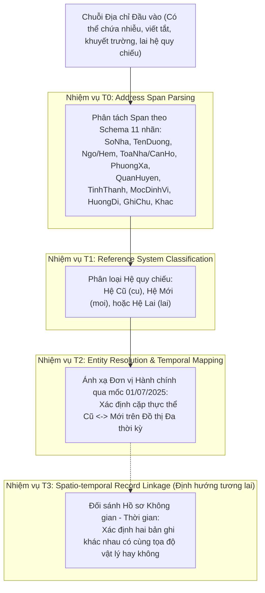

# CHƯƠNG 1: ĐỘNG LỰC NGHIÊN CỨU VÀ ĐẶT VẤN ĐỀ

---

## 1.1. Bối cảnh Lịch sử và Thực tiễn của Cải cách Hành chính Việt Nam năm 2025

Quản lý địa giới hành chính và dữ liệu không gian dân cư là nền tảng cốt lõi của mọi hệ thống thông tin quốc gia, từ quản lý hành chính công, tư pháp, thuế, quản lý đất đai, cho đến các hoạt động kinh tế vi mô như logistics, thương mại điện tử và dịch vụ tài chính số. Tại Việt Nam, hệ thống hành chính lịch sử được tổ chức theo mô hình phân tầng ba cấp truyền thống quy định tại Hiến pháp và Luật Tổ chức chính quyền địa phương: Cấp tỉnh (Tỉnh / Thành phố trực thuộc Trung ương), Cấp huyện (Quận / Huyện / Thị xã / Thành phố thuộc tỉnh) và Cấp xã (Phường / Xã / Thị trấn).

Tuy nhiên, nhằm tinh gọn bộ máy hành chính, nâng cao hiệu lực quản lý nhà nước và mở rộng không gian phát triển đô thị, Ủy ban Thường vụ Quốc hội đã ban hành **Nghị quyết số 35/2023/UBTVQH15** về việc sắp xếp đơn vị hành chính cấp huyện, cấp xã giai đoạn 2023–2025, được cụ thể hóa thông qua **Nghị quyết số 117/NQ-CP** của Chính phủ. Đỉnh điểm của lộ trình cải cách này là thời điểm **01/07/2025**, khi hàng loạt nghị quyết sắp xếp địa giới hành chính chính thức có hiệu lực trên phạm vi cả nước:
1. **Tái cấu trúc và hợp nhất đơn vị cấp xã:** Hàng trăm phường, xã, thị trấn tại $63$ tỉnh, thành phố trực thuộc trung ương tiến hành giải thể, hợp nhất hoặc chia tách địa giới hành chính.
2. **Chuyển đổi mô hình phân cấp chính quyền đô thị:** Tại nhiều đô thị lớn và các khu vực sáp nhập trọng điểm, mô hình tổ chức chính quyền địa phương chuyển dịch từ cấu trúc phân cấp ba tầng sang cấu trúc **hai tầng tinh gọn** (chỉ còn Tỉnh/Thành phố trực thuộc Trung ương $\to$ Phường/Xã/Đặc khu hành chính), bãi bỏ hoàn toàn cấp trung gian (Quận/Huyện) tại các khu vực này.

Sự biến chuyển sâu sắc này đã tạo ra một bước ngoặt chưa từng có trong lịch sử quản trị dữ liệu địa chỉ tại Việt Nam: sự thay đổi đồng loạt, đột ngột của hàng triệu địa chỉ dân cư, tổ chức và cơ sở hạ tầng kinh tế - xã hội chỉ sau một mốc thời gian pháp lý.

---

## 1.2. Thách thức Cốt lõi của Bài toán Xử lý Địa chỉ Tiếng Việt

Địa chỉ tại Việt Nam từ lâu đã được giới nghiên cứu khoa học máy tính và xử lý ngôn ngữ tự nhiên (NLP) đánh giá là một trong những hệ thống địa chỉ phức tạp và phi cấu trúc nhất trên thế giới. Sự phức tạp này bắt nguồn từ các đặc trưng ngôn ngữ và văn hóa đô thị đặc thù:
- **Đa dạng về cú pháp biểu diễn và định dạng phi chuẩn:** Trong văn bản giao dịch thực tế (hóa đơn thương mại, vận đơn bưu chính, tin nhắn mua hàng), địa chỉ thường không tuân thủ bất kỳ cấu trúc cố định nào. Các trường địa chỉ có thể bị đảo lộn thứ tự (ví dụ: đưa quận/huyện lên trước tên đường, hoặc đặt số nhà ở cuối chuỗi).
- **Mật độ viết tắt cực cao và không đồng nhất:** Người dân và nhân viên bưu chính sử dụng vô số quy ước viết tắt tự phát (ví dụ: `P.` cho Phường, `Q.` cho Quận, `TX.` cho Thị xã, `TP.` cho Thành phố, `TT.` vừa có thể là Thị trấn vừa có thể là Tỉnh/Thành phố hoặc Trung tâm).
- **Nhiễu văn bản thực tế từ quá trình OCR và gõ phím:** Dữ liệu địa chỉ thu nhận từ văn bản scan hóa đơn hoặc biểu mẫu viết tay thông qua công nghệ nhận dạng ký tự quang học (OCR) thường xuyên bị lỗi mất dấu tiếng Việt, nhầm lẫn ký tự hình học tương đồng (ví dụ: `Đ` thành `D` hoặc `E`, số `0` thành chữ `O`, dấu phẩy `,` thành dấu chấm `.`).
- **Sự phụ thuộc vào mốc định vị không gian và cấu trúc hẻm/ngõ phức tạp:** Tại các đô thị có lịch sử phát triển lâu đời như Hà Nội và Thành phố Hồ Chí Minh, cấu trúc địa chỉ dạng "ngõ trong ngách, ngách trong hẻm" (ví dụ: `Số 12/45/3/2 Đường X`) hoặc định vị qua mốc phi hành chính (ví dụ: `Cạnh cây xăng số 3`, `Đối diện cổng chợ`) chiếm tỷ trọng đáng kể nhưng các hệ thống định danh hành chính chính thức không bao quát được.

---

## 1.3. Khủng hoảng Tham chiếu Kép (Dual Reference Frame Crisis)

Sau mốc thời điểm 01/07/2025, một bài toán nan giải xuất hiện trong thực tiễn: **Khủng hoảng Tham chiếu Kép**. Về mặt pháp lý, hệ thống hành chính mới có hiệu lực kể từ ngày 01/07/2025. Tuy nhiên, trong thực tế đời sống và dữ liệu thông tin số, hai hệ thống địa chỉ không thay thế nhau ngay lập tức mà cùng tồn tại song song trong một khoảng thời gian dài:
- **Hệ thống Cũ (Hệ quy chiếu Lịch sử - `cu`):** Tiếp tục tồn tại trên hàng chục triệu giấy tờ chứng thực pháp lý đã cấp (Căn cước công dân, Giấy chứng nhận quyền sử dụng đất, Hợp đồng kinh tế, Cơ sở dữ liệu lịch sử ngành ngân hàng, thuế, bảo hiểm).
- **Hệ thống Mới (Hệ quy chiếu Hiện hành - `moi`):** Được áp dụng trong các giao dịch phát sinh mới, cổng dịch vụ công trực tuyến và hệ thống bản đồ số cập nhật.

Hậu quả là các cơ quan quản lý và doanh nghiệp logistics phải đối mặt với dòng dữ liệu "hỗn loạn": một bưu gửi có thể ghi theo địa chỉ cũ, chứng từ thanh toán ghi theo địa chỉ mới, hoặc người mua hàng ghi một địa chỉ pha trộn giữa tên phường cũ và tên tỉnh mới. Nếu không có một nền tảng khoa học có khả năng chuẩn hóa, phân loại hệ quy chiếu và liên kết thực thể chính xác, mọi quy trình tự động hóa chuỗi cung ứng, phân phối bưu chính và kết nối dữ liệu liên ngành đều có nguy cơ tê liệt hoặc phát sinh chi phí xử lý thủ công khổng lồ.

---

## 1.4. Bốn Tình huống Không gian - Thời gian Then chốt (Scenarios A, B, C, D)

Để mô hình hóa toán học và xử lý triệt để cuộc khủng hoảng tham chiếu kép, đề tài phân rã bài toán thành $4$ tình huống không gian - thời gian cốt lõi:

```mermaid
flowchart LR
    subgraph S_A ["Tình huống A: Ánh xạ Xuôi"]
        A_Old["Địa chỉ Cũ (Trước 01/07/2025)"] -->|Chuyển đổi 1-1, N-1, 1-N, M-N| A_New["Địa chỉ Mới (Pháp lý 2025)"]
    end

    subgraph S_B ["Tình huống B: Ánh xạ Ngược"]
        B_New["Địa chỉ Mới (Hiện hành)"] -.->|Phân rã Lịch sử 1-N (Bất định)| B_Old["Địa chỉ Cũ (Hồ sơ Lưu trữ)"]
    end

    subgraph S_C ["Tình huống C: Địa chỉ Lai"]
        C_Mix["Chuỗi Lai (C1, C2, C3)"] -->|Phân tách Span| C_Res["Tách Cũ/Mới & Tái đồng bộ"]
    end

    subgraph S_D ["Tình huống D: Nhập nhằng Không gian"]
        D_Amb["Đồng âm / Mất neo phân cấp"] -->|Đồ thị Tri thức + Tọa độ| D_Dis["Giải quyết Trùng lặp"]
    end
```

### 1.4.1. Tình huống A: Ánh xạ Xuôi từ Hệ Cũ sang Hệ Mới (Old $\to$ New)
Ánh xạ các địa chỉ lịch sử được ghi nhận trước thời điểm sáp nhập sang định danh pháp lý mới có hiệu lực sau ngày 01/07/2025. Bài toán bao gồm $4$ dạng quan hệ biến đổi đồ thị:
- Quan hệ $1-1$ (Đổi tên đơn thuần hoặc chuyển đổi nguyên trạng).
- Quan hệ $N-1$ (Hợp nhất nhiều xã/phường cũ thành một phường mới duy nhất).
- Quan hệ $1-N$ (Một xã cũ bị chia tách địa giới sang nhiều phường mới khác nhau).
- Quan hệ $M-N$ (Nhiều xã cũ vừa chia tách vừa hợp nhất đan xen thành nhiều đơn vị hành chính mới).

### 1.4.2. Tình huống B: Ánh xạ Ngược từ Hệ Mới về Hệ Cũ (New $\to$ Old)
Truy vết ngược một địa chỉ hiện hành về địa danh hành chính lịch sử phục vụ công tác tra cứu hồ sơ địa chính lưu trữ, xác minh lịch sử tư pháp và dữ liệu di sản.
> [!IMPORTANT]
> **Ghi nhận Thực nghiệm Khoa học:** Trong toàn bộ các công cụ và bộ dữ liệu baseline hiện hành của đề tài, **Tình huống B CHƯA ĐƯỢC ĐÁNH GIÁ (Un-evaluated)**. Về mặt lý thuyết, chiều ngược $1 \to N$ đòi hỏi phân định ranh giới không gian chi tiết tới cấp thửa đất hoặc số nhà lịch sử; khi thiếu dữ liệu tọa độ giải thửa, ánh xạ ngược là bài toán bất định về mặt toán học.

### 1.4.3. Tình huống C: Phân giải Địa chỉ Lai (Hybrid Addresses)
Xử lý các địa chỉ người dùng kết hợp không nhất quán các thành phần cũ và mới trong cùng một chuỗi văn bản. Đề tài chuẩn hóa thành $3$ kiểu lai:
- **Kiểu C1 (Phường cũ + Tỉnh mới, khuyết quận):** Chiếm $70{,}00\%$ ($420 / 600$) các ca lai thực tế.
- **Kiểu C2 (Phường mới + Quận cũ + Tỉnh mới):** Chiếm $20{,}00\%$ ($120 / 600$) các ca lai thực tế.
- **Kiểu C3 (Phường mới + Tỉnh cũ, khuyết quận):** Chiếm $10{,}00\%$ ($60 / 600$) các ca lai thực tế.

### 1.4.4. Tình huống D: Nhập nhằng Không gian và Đồng âm Địa danh (Spatial & Toponym Ambiguity)
Giải quyết hiện tượng trùng lặp danh xưng hành chính qua các đường biên giới lịch sử. Khi địa chỉ bị khuyết các neo phân cấp bậc cao (như quận/huyện hoặc tỉnh/thành), việc xác định đúng thực thể địa lý duy nhất đòi hỏi phải kết hợp suy luận ngữ cảnh không gian và đồ thị hành chính đa thời kỳ.

---

## 1.5. Giới hạn của các Phương pháp Tiếp cận Truyền thống Dựa trên Luật

Các hệ thống xử lý địa chỉ hiện hành tại Việt Nam đa phần phát triển dựa trên phương pháp luật dẫn (rule-based) và so khớp từ điển tĩnh (dictionary lookup):
1. **Tính giòn (Brittleness) trước nhiễu và từ viết tắt:** Chỉ cần một lỗi chính tả nhỏ (lỗi OCR hoặc gõ phím), toàn bộ cây so khớp từ điển (`Trie` hoặc bảng băm) bị đứt gãy hoàn toàn.
2. **Không thích ứng với số nhà phi truyền thống:** Các biểu thức chính quy (`Regex`) thường được thiết kế cứng nhắc dựa trên giả định số nhà bắt đầu bằng chữ số (ví dụ: `^(\d+)`), dẫn đến việc bỏ sót toàn bộ các định dạng số nhà hiện đại trong các khu đô thị mới (ví dụ: biệt thự `BT01-05`, liền kề `LK03-12`, nhà phố thương mại `SH-09`).
3. **Sự cưỡng chế cấu trúc phân tầng tĩnh:** Một bộ bóc tách được lập trình cho hệ thống cũ sẽ bắt buộc tìm kiếm $3$ cấp (Xã - Huyện - Tỉnh). Khi gặp dữ liệu hệ mới gồm $2$ cấp, hệ thống hoặc báo lỗi cú pháp, hoặc cố tình ép gán sai nhãn để lấp đầy cấu trúc định sẵn.

---

## 1.6. Giới hạn của các Mô hình Học máy và NLP Quốc tế Hiện có

Các công cụ phân tích cú pháp địa chỉ mã nguồn mở nổi tiếng thế giới, tiêu biểu là thư viện **Libpostal** (sử dụng mô hình Conditional Random Fields - CRF kết hợp giải thuật token hóa JVector đa ngôn ngữ), bộc lộ những khiếm khuyết mang tính hệ thống khi triển khai tại Việt Nam:
1. **Thiếu vắng dữ liệu huấn luyện bản địa hóa sâu:** Dữ liệu huấn luyện của Libpostal chủ yếu dựa trên OpenStreetMap toàn cầu nhưng chưa từng được tinh chỉnh (fine-tuned) trên các tập địa chỉ giao dịch thực tế của người Việt.
2. **Sai lệch gán nhãn nghiêm trọng giữa các cấp hành chính:** Do tiếng Việt có nhiều cấp đô thị trùng tên (Thành phố thuộc tỉnh, Phường trùng tên Quận), Libpostal thường xuyên nhầm lẫn toàn bộ các token phường/xã thành `city`, dẫn đến tỷ lệ ảo giác trường (`Hallucination Rate`) lên tới trên $70\%$ trong các thử nghiệm thực tế.
3. **Hoàn toàn bất lực trước bài toán biến đổi theo thời gian:** Các mô hình học máy truyền thống chỉ xem bài toán phân tích địa chỉ là bài toán gán nhãn chuỗi tĩnh ($X \to Y$). Chúng hoàn toàn không có nhận thức về dòng thời gian lịch sử, không phân biệt được chuỗi địa chỉ đang tham chiếu tới thời kỳ trước hay sau cải cách 2025.

---

## 1.7. Định nghĩa Bài toán Khoa học và Hệ thống Nhiệm vụ T0 – T3

Đề tài DACN xây dựng một hệ thống nhiệm vụ nghiên cứu khoa học chặt chẽ, tạo nền tảng toàn diện để giải quyết bài toán địa chỉ tiếng Việt:



- **Nhiệm vụ T0 — Address Span Parsing:** Phân tách và gán nhãn các đoạn văn bản (spans) theo cấu trúc chuẩn $11$ thành phần theo đề cương nghiên cứu: `SoNha`, `TenDuong`, `Ngo/Hem`, `ToaNha/CanHo`, `PhuongXa`, `QuanHuyen`, `TinhThanh`, `MocDinhVi`, `HuongDi`, `GhiChu`, `Khac`.
- **Nhiệm vụ T1 — Reference System Classification:** Phân loại hệ quy chiếu thời gian của chuỗi địa chỉ đầu vào thành $3$ nhãn độc lập: Hệ cũ (`cu`), Hệ mới (`moi`), hoặc Hệ lai (`lai`).
- **Nhiệm vụ T2 — Administrative Entity Resolution & Temporal Mapping:** Chuẩn hóa và liên kết các thực thể hành chính bóc tách được vào đồ thị tri thức hành chính quốc gia, giải quyết bài toán ánh xạ qua thời điểm sáp nhập 01/07/2025.
- **Nhiệm vụ T3 — Spatio-temporal Record Linkage:** Đối sánh hai địa chỉ bất kỳ theo không gian và thời gian, xác định liệu hai chuỗi văn bản khác biệt về mặt từ vựng có cùng trỏ về một thực thể vật lý trên mặt đất hay không (định hướng nghiên cứu mở rộng giai đoạn sau).

---

## 1.8. Bằng chứng Thực nghiệm từ Đợt Kiểm toán Toàn diện Baseline ($13.000$ Mẫu)

Tính cấp thiết và động lực của đề tài được khẳng định một cách thuyết phục thông qua đợt kiểm toán thực nghiệm quy mô lớn trên $13.000$ lượt dự đoán khoa học độc lập của hai công cụ đại diện:

| Tiêu chí Kiểm định Thực nghiệm | Libpostal (Mô hình CRF Quốc tế) | VietnamAdminUnits (Bộ Luật Bản địa) | Đánh giá Ý nghĩa Khoa học |
| :--- | :---: | :---: | :--- |
| **Độ chính xác Tuyệt đối trên Địa chỉ Sạch Mới (Data 01)** | **$2 / 1.000 = 0{,}20\%$** | **$973 / 1.000 = 97{,}30\%$** | Libpostal bị lỗi adapter và sai lệch token nghiêm trọng; VietnamAdminUnits tối ưu trên từ điển chuẩn. |
| **Tỷ lệ Ảo giác Quận/Huyện ở Hệ 2 Cấp (Data 01)** | **$775 / 1.000 = 77{,}50\%$** | **$0 / 1.000 = 0{,}00\%$** | Libpostal tự ý bịa đặt cấp quận ở $77{,}50\%$ số mẫu hệ mới 2 cấp do luật chuyển đổi adapter thô sơ. |
| **Độ sụt giảm Hiệu năng trước Nhiễu OCR (Data 02 Clean $\to$ Noisy)** | Giữ nguyên mức thấp ($0{,}10\% \to 0{,}10\%$) | **Sụp đổ từ $86{,}20\%$ xuống $21{,}70\%$** (Giảm $64{,}50\%$) | Có tới $645 / 862 = 74{,}83\%$ mẫu đúng trên văn bản sạch bị đoán sai khi có nhiễu; chứng minh sự bất lực của bộ luật tĩnh. |
| **Tỷ lệ Bỏ sót Số nhà Tiền tố Chữ (Data 03, $N = 1.500$)** | $1.474 / 1.500 = 98{,}27\%$ (Bỏ sót trường) | **$284 / 1.500 = 18{,}93\%$** (Mất trắng số nhà) | Regex `^(\d+)` làm tê liệt việc trích xuất số nhà dạng `NT02-29`, `LK03-12` tại các khu đô thị mới. |
| **Phục hồi Thông tin Hành chính bị Khuyết (Data 04 Task B)** | **$0 / 241 = 0{,}00\%$** phục hồi Phường | **$5 / 241 = 2{,}07\%$** phục hồi Phường | Cả hai công cụ hoàn toàn không có khả năng suy luận đồ thị để tái tạo thành phần hành chính bị thiếu. |
| **Lỗi Sai đích Âm thầm trong Chuyển đổi $M-N$ (Data 07)** | *Không hỗ trợ chuyển đổi* | **$12 / 356 = 3{,}37\%$** (Gán sai phường mới) | Cơ chế fallback tĩnh `isDefaultNewWard` âm thầm gán sai địa giới hành chính thực tế mà không đưa ra cảnh báo. |

---

## 1.9. Các Câu hỏi Nghiên cứu (Research Questions)

Đề tài tập trung trả lời $4$ câu hỏi nghiên cứu cốt lõi:
- **RQ1 (Sequence Parsing & Noise Robustness):** Làm thế nào để xây dựng một kiến trúc mô hình học sâu có khả năng bóc tách chính xác $11$ nhãn span địa chỉ tiếng Việt, đồng thời duy trì độ bền vững cao trước các dạng nhiễu OCR, lỗi chính tả và quy ước viết tắt tự phát?
- **RQ2 (Reference Frame Identification):** Phương pháp nào cho phép tự động phân loại chính xác hệ quy chiếu không gian - thời gian (`cu`, `moi`, `lai`) của một chuỗi địa chỉ văn bản mà không phụ thuộc vào siêu dữ liệu bên ngoài?
- **RQ3 (Temporal Graph Entity Resolution):** Làm thế nào để mô hình hóa mạng lưới sáp nhập, chia tách đơn vị hành chính thành một đồ thị tri thức đa thời kỳ, cho phép ánh xạ chính xác và ngăn chặn triệt để lỗi sai đích âm thầm trong các mối quan hệ phức tạp $1-N$ và $M-N$?
- **RQ4 (Selective Prediction & Abstention):** Cơ chế định lượng độ tin cậy và từ chối dự đoán (abstention mechanism) nào cần được thiết lập để hệ thống chủ động chuyển các trường hợp nhập nhằng không gian nghiêm trọng sang xử lý bán tự động, bảo đảm an toàn pháp lý tuyệt đối?

---

## 1.10. Giả thuyết Nghiên cứu và Phạm vi Giới hạn (Scope & Assumptions)

### 1.10.1. Các Giả thuyết Nghiên cứu (Assumptions)
1. **Tính chân thực của bảng sáp nhập hành chính:** Tập dữ liệu `vietnam-sap-nhap-phuong-xa.csv` được coi là nguồn chân lý chuẩn (ground truth) về các cạnh sáp nhập pháp lý có hiệu lực từ ngày 01/07/2025.
2. **Tính bất biến của định danh cấp cơ sở:** Trong các cặp quan sát lịch sử từ OSM diff, số nhà và tên đường được giả định là không thay đổi vị trí vật lý trong khoảng thời gian sáp nhập địa giới hành chính.

### 1.10.2. Phạm vi Giới hạn (Limitations & Scope)
- Đề tài tập trung xử lý địa chỉ trên lãnh thổ nước Cộng hòa Xã hội Chủ nghĩa Việt Nam chịu tác động của cải cách hành chính năm 2025.
- Bài toán T3 (Record Linkage không gian thời gian hoàn chỉnh) và thu thập tập dữ liệu mốc (Data 05) được định vị là mục tiêu mở rộng cho các giai đoạn nghiên cứu sau do hạn chế về nguồn dữ liệu mở có bản quyền thương mại tại thời điểm hiện tại.
- Tình huống B (Ánh xạ ngược Mới $\to$ Cũ) được ghi nhận là bài toán mở và chưa nằm trong phạm vi đánh giá của các baseline thực nghiệm hiện tại.

---

## 1.11. Đóng góp Khoa học của Đề tài

1. **Bộ Benchmark Khoa học Đầu tiên về Địa chỉ Tiếng Việt qua Biến đổi 2025:** Xây dựng thành công bộ dữ liệu chuẩn hóa gồm $7$ tập con với nguồn gốc truy xuất minh bạch từ OpenStreetMap full-history và các văn bản pháp quy, cung cấp công cụ kiểm định tiêu chuẩn cho cộng đồng nghiên cứu NLP Việt Nam.
2. **Báo cáo Kiểm toán Thực nghiệm Độc lập và Phát hiện Lỗi Âm thầm:** Lần đầu tiên chỉ ra và chứng minh bằng thực nghiệm toán học các điểm nghẽn nghiêm trọng của các công cụ hàng đầu (Libpostal và VietnamAdminUnits), đặc biệt là hiện tượng ảo giác cấp quận ($77{,}50\%$) và lỗi sai đích âm thầm trong quan hệ chia tách $M-N$ ($3{,}37\%$).
3. **Đề xuất Kiến trúc Hai Giai đoạn (Two-Stage Architecture):** Thiết lập khung kiến trúc kết hợp giữa mô hình ngôn ngữ ngữ cảnh thích ứng (Contextual Language Model - PhoBERT/CRF) cho nhiệm vụ bóc tách chuỗi và Đồ thị Tri thức Hành chính Đa thời kỳ (Multi-temporal Knowledge Graph) cho nhiệm vụ phân giải thực thể.

---

## 1.12. Bố cục Tổng thể của Báo cáo Đồ án

Báo cáo nghiên cứu của đồ án được cấu trúc thành $5$ chương chính:
- **Chương 1: Động lực Nghiên cứu và Đặt Vấn đề:** Trình bày bối cảnh lịch sử cải cách 2025, khủng hoảng tham chiếu kép, $4$ tình huống then chốt, mục tiêu và các câu hỏi nghiên cứu.
- **Chương 2: Cơ sở Lý thuyết và Tổng quan Nghiên cứu:** Hệ thống hóa lý thuyết bóc tách địa chỉ, đồ thị biến đổi không gian - thời gian, phân giải địa danh toponymy và phân tích chi tiết cơ chế của các baseline.
- **Chương 3: Phương pháp Xây dựng Bộ Benchmark và Kiểm chuẩn Dữ liệu:** Chi tiết hóa quy trình trích xuất OSM full-history, phân bố nhiễu thực tế từ hóa đơn VQA và phương pháp tạo lập các tập dữ liệu chuyên đề.
- **Chương 4: Thiết kế và Hiện thực Hệ thống Đề xuất:** Trình bày chi tiết kiến trúc mô hình hai giai đoạn, cơ chế phân loại hệ quy chiếu và thuật toán phân giải thực thể đồ thị.
- **Chương 5: Thực nghiệm, Đánh giá và Thảo luận:** Phân tích thực nghiệm đa chiều, đối sánh kết quả với baseline, phân tích các trường hợp điển hình và định hướng phát triển tương lai.
