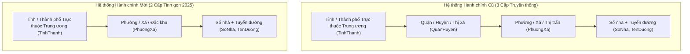
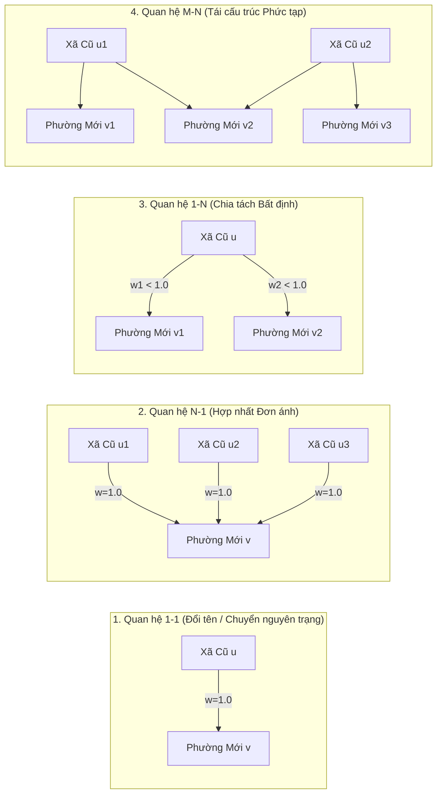
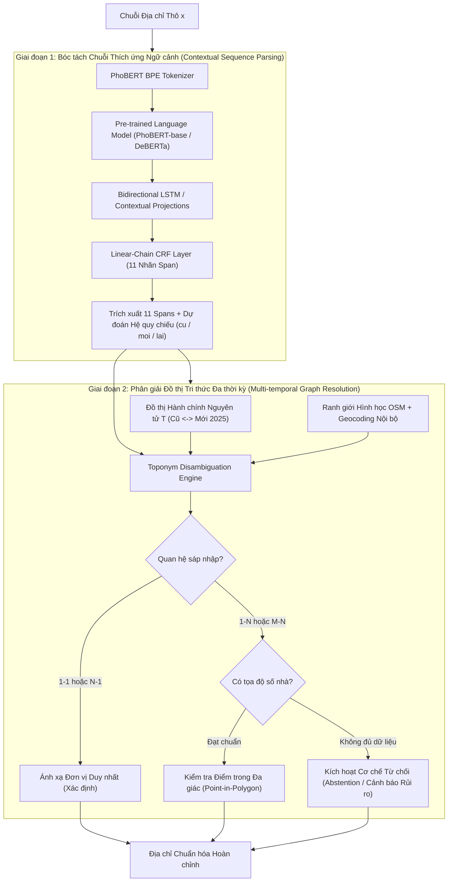

# CHƯƠNG 2: CƠ SỞ LÝ THUYẾT VÀ TỔNG QUAN NGHIÊN CỨU

---

## 2.1. Bài toán Phân tích Cú pháp Địa chỉ (Address Parsing) dưới góc nhìn Xử lý Ngôn ngữ Tự nhiên

Phân tích cú pháp địa chỉ (Address Parsing) là một phân nhánh chuyên sâu của bài toán Nhận dạng Thực thể Tên (Named Entity Recognition - NER) và Gán nhãn Chuỗi (Sequence Labeling) trong Xử lý Ngôn ngữ Tự nhiên (NLP). 

Về mặt toán học, cho một chuỗi văn bản đầu vào $\mathbf{x} = (x_1, x_2, \dots, x_T)$ biểu diễn một địa chỉ chưa cấu trúc bao gồm $T$ tokens. Mục tiêu của bài toán phân tích cú pháp địa chỉ là tìm một chuỗi nhãn tối ưu $\hat{\mathbf{y}} = (y_1, y_2, \dots, y_T)$ từ tập nhãn thực thể xác định trước $\mathcal{Y}$, sao cho:

$$\hat{\mathbf{y}} = \arg\max_{\mathbf{y} \in \mathcal{Y}^T} P(\mathbf{y} \mid \mathbf{x})$$

Khác với văn bản tự nhiên thông thường (như tin tức, bài báo khoa học), văn bản địa chỉ có các đặc trưng toán - ngôn ngữ học đặc thù:
1. **Tính cấu trúc phân tầng ngầm định (Implicit Hierarchical Structure):** Một địa chỉ hợp lệ luôn biểu diễn một đường đi có hướng từ cấp thấp nhất (điểm đơn vị - Point/Unit Level) lên cấp cao nhất (vùng lãnh thổ - Admin Level).
2. **Sự vắng mặt của ngữ pháp liên kết (Absence of Syntactic Connectors):** Văn bản địa chỉ hầu như không chứa động từ, trợ từ, hoặc cấu trúc chủ - vị mà là một chuỗi liên kết các cụm danh từ riêng (proper noun phrases) ngăn cách bởi dấu phẩy, dấu gạch chéo hoặc khoảng trắng tự do.
3. **Sự phụ thuộc chuỗi bậc cao (High Higher-order Transition Dependencies):** Xác suất chuyển trạng thái giữa các nhãn $P(y_t \mid y_{t-1}, \dots)$ có tính ràng buộc cực kỳ chặt chẽ. Ví dụ, nhãn `TenDuong` (Tên đường) thường xuất hiện ngay sau `SoNha` (Số nhà) và đi trước `PhuongXa` (Phường/Xã); việc một `PhuongXa` xuất hiện ngay sau `SoNha` mà không có tên đường thường là chỉ dấu của một chuỗi bị khuyết trường hoặc địa chỉ nông thôn.

---

## 2.2. Lược đồ Nhãn Span Địa chỉ Tiếng Việt (11 Nhãn Đề tài DACN)

Để bao quát toàn bộ sự phức tạp của thực tiễn đô thị và hành chính tại Việt Nam, đề tài DACN thiết lập **Lược đồ nhãn span gồm $11$ lớp thực thể** theo đề cương nghiên cứu:

| STT | Nhãn Thực thể | Ký hiệu Chuẩn | Phạm vi Ngữ nghĩa và Ví dụ Thực tế |
| :---: | :--- | :---: | :--- |
| **1** | Số nhà | `SoNha` | Số định danh công trình trên tuyến đường (ví dụ: `12`, `45A`, `NT02-29`, `LK03-12`, `Lô B2`). |
| **2** | Tên đường | `TenDuong` | Tuyến giao thông huyết mạch hoặc nội bộ (ví dụ: `Đường Giải Phóng`, `Phố Huế`, `Đại lộ Thăng Long`). |
| **3** | Ngõ / Hẻm | `Ngo/Hem` | Tuyến giao thông phụ kết nối số nhà với trục đường chính (ví dụ: `Ngõ 102`, `Hẻm 45/3`, `Ngách 12/4/1`). |
| **4** | Tòa nhà / Căn hộ | `ToaNha/CanHo` | Định danh cấu trúc không gian ba chiều (ví dụ: `Phòng 402`, `Căn hộ A12`, `Tòa Landmark 81`). |
| **5** | Phường / Xã | `PhuongXa` | Đơn vị hành chính cấp cơ sở (ví dụ: `Phường Điện Biên`, `Xã Tân Lập`, `Thị trấn Cát Bà`). |
| **6** | Quận / Huyện | `QuanHuyen` | Đơn vị hành chính cấp trung gian trong hệ thống lịch sử (ví dụ: `Quận Ba Đình`, `Huyện Gia Lâm`, `Thị xã Sơn Tây`). |
| **7** | Tỉnh / Thành phố | `TinhThanh` | Đơn vị hành chính cấp địa phương cao nhất (ví dụ: `Thành phố Hà Nội`, `Tỉnh Bắc Ninh`). |
| **8** | Mốc định vị | `MocDinhVi` | Địa vật hoặc cơ sở hạ tầng được dùng để định vị tương đối (ví dụ: `Đối diện Bệnh viện Bạch Mai`, `Cạnh cổng chợ`). |
| **9** | Hướng đi | `HuongDi` | Chỉ dẫn vector không gian hỗ trợ tìm đường (ví dụ: `Rẽ trái sau ngã tư`, `Đi thẳng vào cuối ngõ`). |
| **10** | Ghi chú | `GhiChu` | Thông tin phụ trợ phục vụ giao dịch hoặc bưu bưu chính (ví dụ: `Gọi trước khi giao`, `Gửi bảo vệ`). |
| **11** | Khác | `Khac` | Các token rác, số điện thoại, mã đơn hàng không thuộc $10$ thành phần trên. |

### Sự biến đổi Cấu trúc Phân tầng: Hệ 3 Cấp so với Hệ 2 Cấp

Cải cách hành chính năm 2025 tạo ra sự đứt gãy về cấu trúc cây phân cấp hành chính:

Trong hệ thống mới, cấp `QuanHuyen` bị loại bỏ hoàn toàn tại các đô thị thực hiện sắp xếp. Đây là một biến đổi cấu trúc sâu sắc: chiều sâu cây định danh bị rút ngắn từ $3$ xuống $2$, làm thay đổi toàn bộ không gian không gian địa danh và triệt tiêu một lớp neo trung gian vốn đóng vai trò khử nhập nhằng cho các đơn vị cấp xã.

---

## 2.3. Lý thuyết Phân cấp Hành chính và Sự Tiến hóa Không gian - Thời gian

Một hệ thống phân cấp hành chính (Administrative Hierarchy) tại thời điểm $t$ có thể được hình thức hóa như một cấu trúc cây $H^{(t)} = (V^{(t)}, E^{(t)})$, trong đó $V^{(t)}$ là tập hợp các thực thể lãnh thổ tại thời điểm $t$, và cạnh có hướng $(u, v) \in E^{(t)}$ thể hiện quan hệ quản lý không gian trực tiếp (Spatial Containment):

$$\text{Polygon}(u) \subset \text{Polygon}(v)$$

Theo thời gian $t \in [t_0, t_1]$, cải cách địa giới hành chính tạo ra sự dịch chuyển từ cây $H^{(t_0)}$ sang cây $H^{(t_1)}$. Sự dịch chuyển này làm phát sinh bài toán tiến hóa không gian - thời gian (Spatio-Temporal Evolution), đòi hỏi mọi phép gán nhãn chuỗi địa chỉ phải được đặt trong một tọa độ thời gian cụ thể:

$$\mathcal{M}: (\mathbf{x}, t) \mapsto \mathbf{y}$$

Nếu không xác định được tham chiếu thời gian $t$, việc xác định một chuỗi địa chỉ có hợp lệ hay không trở thành một bài toán vô nghĩa.

---

## 2.4. Lý thuyết Phân giải Địa danh (Toponym Resolution) và Nhập nhằng Không gian

Phân giải địa danh (Toponym Resolution) là quá trình liên kết một chuỗi ký tự tên riêng địa lý (Toponym Mention) trong văn bản với một thực thể địa lý duy nhất (Spatial Entity / Location) trong thế giới thực.

Trong địa danh học Việt Nam, thách thức lớn nhất là **Tính Nhập nhằng Không gian (Spatial Ambiguity)**, biểu hiện qua hai hình thái chính:
1. **Nhập nhằng Đa sở chỉ (Polysemy / Homonymy):** Cùng một danh xưng bề mặt được đặt cho nhiều thực thể địa lý ở các địa bàn khác nhau. Ví dụ:
   - Tên xã `Kim Sơn` xuất hiện tại hơn $15$ huyện thuộc nhiều tỉnh thành khác nhau trên cả nước.
   - Tên phố `Nguyễn Huệ` có mặt tại hầu hết các đô thị lớn từ Bắc đến Nam.
2. **Nhập nhằng Ranh giới Lịch sử (Historical Boundary Ambiguity):** Một danh xưng trong lịch sử bao phủ một không gian địa lý $S_{\text{old}}$, nhưng sau sáp nhập 2025 lại bao phủ một không gian địa lý mới $S_{\text{new}}$ có diện tích và ranh giới khác biệt hoàn toàn:
   $$S_{\text{old}} \ne S_{\text{new}}, \quad S_{\text{old}} \cap S_{\text{new}} \ne \emptyset$$

Để giải quyết nhập nhằng, mô hình bắt buộc phải khai thác **Ngữ cảnh Phân cấp (Hierarchical Context)**: sự xuất hiện đồng thời của thực thể bậc cao hơn trong chuỗi giúp thu hẹp không gian tìm kiếm hình học. Khi ngữ cảnh phân cấp bị khuyết (như trong bài toán thiếu trường Data 04), độ bất định của toponym resolution tăng theo hàm số mũ.

---

## 2.5. Địa bạ Số và Cơ sở Tri thức Hành chính Đa niên biểu (Multi-Temporal Gazetteers)

Một Địa bạ số (Gazetteer) truyền thống là một từ điển địa lý cung cấp danh mục tên địa danh kèm tọa độ không gian. Tuy nhiên, trước tác động của cải cách 2025, một địa bạ đơn niên biểu (Single-temporal Gazetteer) lập tức trở nên lỗi thời và gây sai lệch nghiêm trọng khi phân tích dữ liệu lịch sử.

Đề tài đặt nền tảng trên khái niệm **Địa bạ Số Đa niên biểu (Multi-Temporal Gazetteer)**, được biểu diễn toán học như một bộ dữ liệu có cấu trúc:

$$\mathcal{G} = \left\{ \langle e, \mathcal{N}(e), \text{Type}(e), \text{Polygon}(e), [t_{\text{start}}, t_{\text{end}}], \mathcal{R} \rangle \right\}$$

Trong đó:
- $e$: Mã định danh duy nhất của thực thể hành chính (Administrative Code).
- $\mathcal{N}(e)$: Tập hợp các biến thể danh xưng bề mặt (tên chính thức, tên viết tắt, tên lịch sử, tên không dấu).
- $\text{Type}(e)$: Loại đơn vị (Tỉnh, Huyện, Xã, Phường, v.v.).
- $\text{Polygon}(e)$: Đa giác không gian địa lý phân định ranh giới lãnh thổ.
- $[t_{\text{start}}, t_{\text{end}}]$: Khoảng thời gian hiệu lực pháp lý của thực thể. Đối với các đơn vị bị giải thể vào ngày 01/07/2025, $t_{\text{end}} = \text{2025-06-30T23:59:59Z}$.
- $\mathcal{R}$: Tập hợp các liên kết tiến hóa sang các thực thể khác (kế thừa, sáp nhập, chia tách).

---

## 2.6. Lý thuyết Đồ thị Biến đổi Hành chính (Merger-Split Transformation Graphs)

Sự biến đổi địa giới hành chính giữa hai thời kỳ $t_0$ và $t_1$ được mô hình hóa chặt chẽ bằng một **Đồ thị Hai phía Có hướng (Directed Bipartite Transformation Graph)**:

$$\mathcal{T} = \left( \mathcal{V}_{\text{old}}, \mathcal{V}_{\text{new}}, \mathcal{E} \right)$$

Trong đó $\mathcal{V}_{\text{old}}$ là tập các đơn vị hành chính hệ cũ, $\mathcal{V}_{\text{new}}$ là tập các đơn vị hành chính hệ mới, và cạnh có hướng $(u, v) \in \mathcal{E}$ thể hiện phần lãnh thổ của đơn vị cũ $u$ được chuyển giao cho đơn vị mới $v$. Cạnh $(u, v)$ có thể mang trọng số không gian $w(u, v) \in (0, 1]$ biểu thị tỷ lệ diện tích đất đai được chuyển giao:

$$w(u, v) = \frac{\text{Area}(\text{Polygon}(u) \cap \text{Polygon}(v))}{\text{Area}(\text{Polygon}(u))}, \quad \sum_{v \in \mathcal{V}_{\text{new}}} w(u, v) = 1$$

Dựa vào bậc vào (in-degree) và bậc ra (out-degree) của các đỉnh trong đồ thị, bốn mô hình cấu trúc sáp nhập được định nghĩa:

1. **Quan hệ $1-1$ ($\text{deg}^+(u) = 1, \text{deg}^-(v) = 1$):** Đơn vị cũ chuyển thành đơn vị mới mà không có sự thay đổi ranh giới; ánh xạ xuôi và ngược đều xác định duy nhất.
2. **Quan hệ $N-1$ ($\text{deg}^+(u_i) = 1, \text{deg}^-(v) > 1$):** Nhiều đơn vị cũ hợp nhất trọn vẹn thành một đơn vị mới. Ánh xạ xuôi xác định duy nhất ($u_i \mapsto v$), nhưng ánh xạ ngược mang tính phân kỳ $1 \to N$.
3. **Quan hệ $1-N$ ($\text{deg}^+(u) > 1, \text{deg}^-(v_j) = 1$):** Một đơn vị cũ bị chia tách địa giới sang nhiều đơn vị mới. Ánh xạ xuôi là bài toán bất định nếu không có thêm thông tin số nhà hoặc tọa độ chi tiết.
4. **Quan hệ $M-N$ ($\text{deg}^+(u) > 1, \text{deg}^-(v) > 1$):** Cấu trúc phức tạp nhất, xuất hiện khi nhiều đơn vị cũ vừa chia tách vừa sáp nhập đan xen nhau. Đòi hỏi độ phân giải không gian cao nhất để xử lý.

---

## 2.7. Lý thuyết Liên kết Thực thể theo Thời gian (Temporal Record Linkage)

Bài toán Liên kết Thực thể (Record Linkage) tìm cách xác định hai bản ghi dữ liệu $r_1$ và $r_2$ có cùng tham chiếu tới một thực thể thế giới thực hay không. Trong ngữ cảnh biến đổi địa giới, bài toán mở rộng thành **Liên kết Thực thể Không gian - Thời gian (Spatio-Temporal Record Linkage)**:

Cho bản ghi địa chỉ cũ $r_{\text{old}}$ tạo lập tại thời điểm $t_0$ và bản ghi địa chỉ mới $r_{\text{moi}}$ tạo lập tại thời điểm $t_1$. Hàm quyết định liên kết:

$$\Phi(r_{\text{old}}, r_{\text{moi}}) \in \{0, 1\}$$

dựa trên hàm tương đồng tích hợp không gian và ngữ nghĩa:

$$\text{Sim}(r_{\text{old}}, r_{\text{moi}}) = \alpha \cdot \text{Sim}_{\text{text}}(\text{Street}_{\text{old}}, \text{Street}_{\text{moi}}) + \beta \cdot \text{GraphReachability}(u_{\text{old}}, v_{\text{moi}}) + \gamma \cdot \text{SpatialProximity}(p_{\text{old}}, p_{\text{moi}})$$

với điều kiện ràng buộc: Nếu $(u_{\text{old}}, v_{\text{moi}}) \notin \mathcal{E}$, thì $\Phi(r_{\text{old}}, r_{\text{moi}}) = 0$ bất kể sự tương đồng về chuỗi văn bản.

---

## 2.8. Lý thuyết về Độ tin cậy Mô hình, Lỗi Âm thầm (Silent Errors) và Cơ chế Từ chối Dự đoán

Trong các bài toán xử lý địa chỉ phục vụ pháp lý và tài chính, chi phí của một dự đoán sai nguy hiểm hơn rất nhiều so với chi phí của việc từ chối dự đoán (Abstention):
- **Dự đoán Sai Âm thầm (Silent Error):** Mô hình gán nhầm địa chỉ sang một đơn vị hành chính sai (ví dụ: gán nhầm phường Ba Đình sang Hoàn Kiếm trong quan hệ $M-N$) mà vẫn trả về mức độ tự tin cao hoặc không có cảnh báo. Lỗi này dẫn đến thất lạc bưu phẩm, sai lệch hồ sơ tư pháp hoặc tranh chấp sở hữu.
- **Từ chối Dự đoán (Selective Prediction / Abstention):** Mô hình chủ động phát hiện sự không chắc chắn (Uncertainty) và trả về nhãn `UNKNOWN` hoặc chuyển sang quy trình can thiệp của con người (Human-in-the-loop).

Về mặt lý thuyết, một bộ phân loại chọn lọc (Selective Classifier) được định nghĩa bởi một cặp $(f, g)$, trong đó $f(\mathbf{x})$ là hàm dự đoán và $g(\mathbf{x}) \in \{0, 1\}$ là hàm chấp nhận (Selection Function):

$$(f, g)(\mathbf{x}) = \begin{cases} f(\mathbf{x}) & \text{nếu } g(\mathbf{x}) = 1 \\ \text{ABSTAIN} & \text{nếu } g(\mathbf{x}) = 0 \end{cases}$$

Hàm chấp nhận $g(\mathbf{x})$ được thiết lập dựa trên ngưỡng tin cậy xác suất và độ bất định trên đồ thị hành chính:

$$g(\mathbf{x}) = \mathbb{I}\left( P(y \mid \mathbf{x}) \ge \tau \quad \wedge \quad \text{deg}^+(u) = 1 \right)$$

Nếu địa chỉ cũ rơi vào một đỉnh $u$ có $\text{deg}^+(u) > 1$ (quan hệ $1-N$ hoặc $M-N$) mà không có tọa độ số nhà để kiểm chứng, hệ thống bắt buộc phải đặt $g(\mathbf{x}) = 0$ để tránh phát sinh lỗi sai đích âm thầm.

---

## 2.9. Phân tích Giải thuật và Cơ sở Lý thuyết của Libpostal

**Libpostal** là thư viện C mã nguồn mở tiêu chuẩn quốc tế cho bài toán chuẩn hóa và phân tích cú pháp địa chỉ toàn cầu.

### 2.9.1. Kiến trúc Giải thuật
- **Token hóa đa ngôn ngữ (JVector Tokenizer):** Chuyển đổi chuỗi văn bản thô thành chuỗi các n-gram ký tự và token từ vựng, chuẩn hóa chữ hoa/thường, chuyển đổi số La Mã sang Ả Rập và bóc tách các tiền tố số nhà.
- **Mô hình Trọng tâm (Averaged Perceptron Conditional Random Fields - CRF):** Mô hình hóa phân bố xác suất có điều kiện của chuỗi nhãn $\mathbf{y}$ với hàm thế năng:
  $$P(\mathbf{y} \mid \mathbf{x}) = \frac{1}{Z(\mathbf{x})} \exp \left( \sum_{t=1}^T \sum_{k} \theta_k f_k(y_{t-1}, y_t, \mathbf{x}, t) \right)$$
  với $f_k$ là các hàm đặc trưng thủ công (từ vựng, hình thái học, tiếp đầu ngữ, tiếp vị ngữ).

### 2.9.2. Điểm nghẽn Cốt lõi đối với Địa chỉ Tiếng Việt
1. **Lỗi Token hóa Ngôn ngữ Đơn lập có Dấu:** Libpostal tách từ dựa chủ yếu vào khoảng trắng và không có cơ chế tách từ ghép tiếng Việt (ví dụ: `Bà Rịa - Vũng Tàu` bị băm thành nhiều token rời rạc `Bà`, `Rịa`, `-`, `Vũng`, `Tàu`).
2. **Sai lệch Khái niệm Phân cấp (Domain Mismatch):** Được huấn luyện trên OpenStreetMap quốc tế với cấu trúc phân tầng phương Tây (`house_number`, `road`, `suburb`, `city`, `state`, `country`), Libpostal không có khái niệm tương thích với cấp `PhuongXa` và `QuanHuyen`. Mô hình thường xuyên ánh xạ token phường của Việt Nam vào nhãn `city`, làm sụp đổ các chỉ số phân tách phân cấp bản địa.

---

## 2.10. Phân tích Giải thuật và Cơ sở Lý thuyết của VietnamAdminUnits

**VietnamAdminUnits** là thư viện Python chuyên biệt được phát triển cho địa bạ hành chính Việt Nam, kết hợp cơ chế so khớp từ điển và phân tích luật.

### 2.10.1. Kiến trúc Giải thuật
- **Khớp Từ điển Cây Tiền tố (Trie Dictionary Matching):** Lưu trữ toàn bộ danh bạ $63$ tỉnh thành, hơn $700$ quận/huyện và hơn $10.000$ xã/phường vào cây Trie để tìm kiếm chuỗi con dài nhất (Longest Matching Prefix).
- **Phân rã Chuỗi dựa trên Dấu phẩy (Comma-separated Heuristic):** Thuật toán giả định các thành phần địa chỉ được ngăn cách bởi dấu phẩy, quét ngược từ phải sang trái: Tỉnh $\to$ Huyện $\to$ Xã $\to$ Tên đường $\to$ Số nhà.
- **Chuyển đổi 2025 (`converter_2025.py`):** Tra cứu bảng ánh xạ sáp nhập; đối với các ca phân tách ranh giới phức tạp, công cụ gọi API ngoài (`geopy.geocoders.ArcGIS`) để lấy tọa độ kinh độ - vĩ độ của số nhà và kiểm tra điểm nằm trong đa giác (Point-in-Polygon).

### 2.10.2. Điểm yếu Cốt lõi và Cơ chế Gây lỗi
1. **Tính giòn của Regex Tách Số nhà:** Biểu thức chính quy `re.match(r"^(\d+[\w\/\-]*)", text)` hoàn toàn thất bại khi gặp số nhà có chữ cái đứng đầu (ví dụ: khu đô thị mới `NT02-29`, `LK-15`), làm mất toàn bộ thông tin số nhà trên $18{,}93\%$ mẫu Data 03.
2. **Sự phụ thuộc Nguy hiểm vào Fallback Tĩnh:** Khi kết nối geocoding ngoại vi thất bại (hoặc không có API key), hàm chuyển đổi tự động fallback chọn phường đầu tiên có cờ `isDefaultNewWard = True`. Cơ chế này trực tiếp tạo ra $12$ lỗi sai đích âm thầm trên Data 07.

---

## 2.11. Kiến trúc Hai Giai đoạn Đề xuất (Proposed Two-Stage Architecture)

Để khắc phục triệt để các hạn chế của cả hai hướng tiếp cận trên, đề tài đề xuất khung kiến trúc **Hai Giai đoạn (Two-Stage Architecture)**:

- **Giai đoạn 1 (Contextual Sequence Parsing):** Sử dụng mô hình ngôn ngữ ngữ cảnh bản địa hóa (PhoBERT) kết hợp tầng CRF để giải quyết triệt để bài toán nhiễu OCR, lỗi mất dấu, từ viết tắt và định dạng số nhà phi truyền thống. Mô hình đồng thời phân loại hệ quy chiếu thời gian của chuỗi.
- **Giai đoạn 2 (Multi-temporal Graph Resolution & Abstention):** Đưa các span hành chính bóc tách được vào Đồ thị Tri thức Hành chính Đa niên biểu. Tích hợp giải thuật kiểm tra điểm trong đa giác và cơ chế từ chối dự đoán chủ động (Abstention) khi gặp các quan hệ chia tách $1-N$ hoặc $M-N$ thiếu bằng chứng tọa độ, triệt tiêu hoàn toàn nguy cơ lỗi sai đích âm thầm.

---

## 2.12. Các Chỉ số Đo lường Hiệu năng Khoa học (Evaluation Metrics)

Hệ thống đánh giá khoa học của đề tài được lượng hóa qua các công thức toán học nghiêm ngặt:

1. **Exact Match Accuracy ($\text{Acc}_{\text{exact}}$):**
   $$\text{Acc}_{\text{exact}} = \frac{1}{N} \sum_{i=1}^N \prod_{f \in \mathcal{F}} \mathbb{I}\left( \text{Norm}(\hat{y}_{i, f}) = \text{Norm}(y_{i, f}^*) \right)$$
2. **Token-level F1 Macro trung bình ($\text{Macro\_F1}$):**
   $$\text{Macro\_F1} = \frac{1}{|\mathcal{F}^*|} \sum_{f \in \mathcal{F}^*} \frac{2 \cdot P_f \cdot R_f}{P_f + R_f}$$
3. **Tỷ lệ Lỗi Sai đích Âm thầm (Silent Error Rate - $\text{SER}$):**
   $$\text{SER} = \frac{N_{\text{wrong\_target}}}{N_{\text{evaluated}}} \times 100\%$$
4. **Kiểm định McNemar Hiệu chỉnh Liên tục ($\chi^2$):**
   $$\chi^2 = \frac{(|n_{10} - n_{01}| - 1)^2}{n_{10} + n_{01}}, \quad \text{với } p = 1 - F_{\chi_1^2}(\chi^2)$$

---

## 2.13. Tổng kết các Khoảng trống Nghiên cứu (Research Gaps)

Thông qua tổng quan tài liệu và kết quả kiểm toán thực nghiệm, bốn khoảng trống nghiên cứu lớn được xác định:
1. **Khoảng trống về Bộ Benchmark Đa thời kỳ:** Chưa có bất kỳ bộ dữ liệu chuẩn hóa công khai nào cho bài toán phân tích địa chỉ tiếng Việt bao quát toàn diện sự kiện cải cách hành chính 2025 và khủng hoảng tham chiếu kép.
2. **Khoảng trống về Xử lý Nhiễu Thực tế:** Các công cụ hiện hành phụ thuộc vào từ điển tĩnh, sụp đổ nghiêm trọng khi gặp nhiễu OCR và viết tắt đời thực (tỷ lệ lỗi tăng hơn $60\%$).
3. **Khoảng trống về Cơ chế Tự nhận thức Hệ quy chiếu:** Thiếu vắng mô hình có khả năng tự động phát hiện chuỗi địa chỉ thuộc hệ cũ, hệ mới hay địa chỉ lai để kích hoạt cơ chế giải mã phù hợp.
4. **Khoảng trống về An toàn Mô hình và Lỗi Âm thầm:** Các hệ thống hiện tại chưa có cơ chế toán học để phát hiện độ bất định không gian, dẫn đến việc tự động gán nhầm đơn vị hành chính trong các quan hệ chia tách $M-N$.

---

## 2.14. Tóm tắt Chương

Chương 2 đã thiết lập nền tảng cơ sở lý thuyết toàn diện cho bài toán phân tích cú pháp và phân giải địa chỉ tiếng Việt qua cải cách 2025. Bằng cách kết hợp lý thuyết gán nhãn chuỗi NLP, lý thuyết đồ thị biến đổi hành chính đa niên biểu và lý thuyết độ tin cậy mô hình, chương đã giải phẫu chi tiết nguyên nhân thất bại của các công cụ tiền nhiệm và phác thảo khung kiến trúc hai giai đoạn tối ưu. Các nền tảng lý thuyết này là kim chỉ nam cho việc thiết kế phương pháp xây dựng dữ liệu và hiện thực hệ thống trong các chương tiếp theo.
