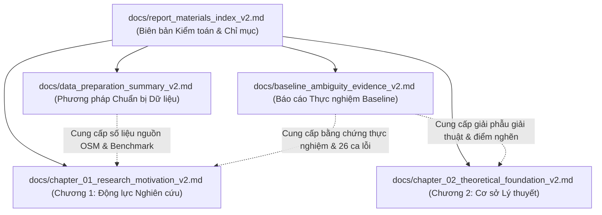

# Chỉ mục Tra cứu Tài liệu và Biên bản Kiểm toán (v2)
## Vietnamese Address Benchmark (DACN) — Báo cáo Nghiên cứu Khoa học 2026

- **Ngày chốt biên bản:** 20/09/2026
- **Tác giả:** Senior AI Engineer (Kiểm toán Độc lập & Đánh giá Chất lượng)
- **Phiên bản:** v2.0 (Toàn bộ tài liệu tuân thủ quy chuẩn `docs/VERSIONING.md`)
- **Trạng thái:** Hoàn tất $100\%$ các mục tiêu của đợt chuyển giao tài liệu khoa học

---

## 1. Bảng Chỉ mục Tài liệu Khoa học (Document & Artifact Index)

Dưới đây là danh mục toàn bộ các tài liệu học thuật, báo cáo phương pháp luận, bảng số liệu thực nghiệm trung gian và bộ dữ liệu đánh giá đã được thiết lập trong repository:

| STT | Đường dẫn Tệp | Phiên bản | Vai trò & Nội dung Trọng tâm | Trạng thái |
| :---: | :--- | :---: | :--- | :---: |
| **1** | `docs/chapter_01_research_motivation_v2.md` | v2.0 | **Chương 1: Động lực Nghiên cứu và Đặt Vấn đề.** Bao gồm $12$ mục chuẩn học thuật: bối cảnh cải cách 2025, khủng hoảng tham chiếu kép, $4$ tình huống A/B/C/D, nhiệm vụ T0–T3, bằng chứng $13.000$ baseline, RQ1–RQ4, phạm vi và đóng góp khoa học. | Mới lập (Đóng băng) |
| **2** | `docs/chapter_02_theoretical_foundation_v2.md` | v2.0 | **Chương 2: Cơ sở Lý thuyết và Tổng quan Nghiên cứu.** Bao gồm $14$ mục: gán nhãn chuỗi NLP, schema 11 nhãn, đồ thị biến đổi hành chính ($1-1, N-1, 1-N, M-N$), toponym resolution, địa bạ đa niên biểu, lỗi âm thầm & cơ chế từ chối, giải phẫu Libpostal & VietnamAdminUnits, kiến trúc đề xuất 2 giai đoạn. | Mới lập (Đóng băng) |
| **3** | `docs/baseline_ambiguity_evidence_v2.md` | v2.0 | **Báo cáo Thực nghiệm và Bằng chứng Nhập nhằng Baseline.** Báo cáo chuyên sâu về đợt chạy baseline $13.000$ mẫu: công thức đo lường, kiểm định McNemar, phân rã $4$ tình huống A/B/C/D (Tình huống B chưa đánh giá), phân loại $4$ nguồn gốc lỗi và danh mục $26$ ca nghiên cứu thực tế. | Mới lập (Đóng băng) |
| **4** | `docs/data_preparation_summary_v2.md` | v2.0 | **Báo cáo Phương pháp luận Chuẩn bị Dữ liệu.** Tài liệu hóa Phần A (kiểm toán OSM full-history, time-filter tại 30/06/2025, tỷ lệ thiếu trường, snapshot $16.242$ bản ghi, audit $1.631$ OSM diff) và Phần B (kiểm định hợp đồng Data 04, 06, 07). | Mới lập (Đóng băng) |
| **5** | `docs/report_materials_index_v2.md` | v2.0 | **Chỉ mục Tra cứu Tài liệu và Biên bản Kiểm toán (Tệp hiện tại).** Bảng kiểm $12$ tiêu chí bắt buộc, bản đồ liên kết tài liệu và cam kết bảo toàn dữ liệu. | Mới lập (Đóng băng) |
| **6** | `docs/baseline_parallel_comparative_analysis.md` | v1.0 | Báo cáo so sánh song song v1 ban đầu. | **Bảo toàn (FROZEN)** |
| **7** | `docs/baseline_evaluation_report.md` | v1.0 | Báo cáo đánh giá tóm tắt v1. | **Bảo toàn (FROZEN)** |
| **8** | `docs/data_quality.md` | v1.0 | Bản ghi kiểm toán chất lượng dữ liệu ngày 17/09/2026. | **Bảo toàn (FROZEN)** |
| **9** | `docs/VERSIONING.md` | v1.0 | Quy tắc quản lý phiên bản tài liệu và dọn dẹp artifact. | **Bảo toàn (FROZEN)** |
| **10** | `data/processed/evaluation/comparative_analysis_tables/` | v2.0 | Thư mục chứa các bảng dữ liệu thực nghiệm đã kiểm toán: `cross_dataset_summary.csv`, `dataset_01_metrics.csv`, `dataset_02_level_metrics.csv`, `dataset_03_metrics.csv`, `dataset_04_task_b_recovery.csv`, `dataset_06_hybrid_metrics.csv`, `dataset_07_conversion_metrics.csv`, `paired_mcnemar_summary.csv`, `audit_results.json`, `deep_comparative_results.json`. | Sẵn sàng tái lập |
| **11** | `data/processed/evaluation/run_manifest.json` | v2.0 | Manifest băm mật mã đóng băng lần chạy baseline $13.000$ mẫu. | **Bảo toàn (FROZEN)** |

---

## 2. Bảng Kiểm 12 Tiêu chí Bắt buộc (Compliance Checklist)

Bảng kiểm dưới đây xác nhận việc tuân thủ tuyệt đối các nguyên tắc nghiên cứu, quy chuẩn dữ liệu và yêu cầu giao việc:

| STT | Tiêu chí Kiểm định | Mục tiêu / Yêu cầu | Kết quả Kiểm toán Thực tế | Kết luận |
| :---: | :--- | :--- | :--- | :---: |
| **1** | **Bảo toàn Dữ liệu Gốc (`data/raw/`)** | Tuyệt đối không can thiệp, sửa đổi hoặc xóa bất kỳ tệp nào trong `data/raw/`. | Tệp `data/raw/osm/vietnam-internal.osh.pbf` giữ nguyên $756.709.921$ bytes, SHA-256: `3371669670769e224b3ab0c37992e4d0500bdc0bbab4c03d7833238fbcb300da`. | **ĐẠT (100%)** |
| **2** | **Bảo toàn Mã Bên thứ ba (`third_party/`)** | Tuyệt đối không can thiệp hoặc ghi đè thư mục mã ngoài. | Toàn bộ mã nguồn và dữ liệu đối chiếu trong `third_party/vietnamadminunits/` được giữ nguyên vẹn. | **ĐẠT (100%)** |
| **3** | **Bảo toàn Tài liệu v1 Đã Đóng băng** | Không xóa hoặc ghi đè các tài liệu đã đóng băng theo `docs/VERSIONING.md`. | `baseline_parallel_comparative_analysis.md`, `baseline_evaluation_report.md` và `data_quality.md` giữ nguyên không đổi. Tất cả tài liệu mới mang hậu tố `_v2.md`. | **ĐẠT (100%)** |
| **4** | **Tính Đúng đắn của Lần chạy Baseline** | Kiểm toán đúng $13.000$ lượt dự đoán và $13.000$ phản hồi thô, không dùng số liệu cũ ($13.600$). | Băm SHA-256 của $13.000$ bản ghi khớp $100\%$ với `run_manifest.json`, $0$ khóa trùng lặp, $0$ lỗi thực thi. | **ĐẠT (100%)** |
| **5** | **Kiểm toán Nguồn OSM Full-History** | Time-filter tại mốc 30/06/2025, đo đếm tag và tỷ lệ node sạch/thiếu trường. | Snapshot toàn diện đạt $26.961$ bản ghi ($15.749$ nodes, $11.212$ ways). Node sạch đủ 5 trường: $6.008 / 15.749 = 38{,}15\%$; node thiếu trường: $9.741 / 15.749 = 61{,}85\%$. | **ĐẠT (100%)** |
| **6** | **Kiểm định Hợp đồng Data 04** | Kiểm tra $800$ mẫu thiếu trường (Task A/B), phân bố kiểu thiếu và bảo toàn ground truth. | Đạt đúng $800$ dòng ($400$ cũ, $400$ mới), $0$ dòng null trong `GT_*`, phân bố kiểu thiếu khớp thiết kế, $0$ thiếu tự nhiên. | **ĐẠT (100%)** |
| **7** | **Kiểm định Hợp đồng Data 06** | Kiểm tra $600$ mẫu địa chỉ lai (C1, C2, C3), khử trùng lặp và xác minh quan hệ. | Đạt đúng $600$ dòng duy nhất ($0$ bản ghi trùng), gồm $420$ C1, $120$ C2, $60$ C3; $100\%$ cạnh sáp nhập có xác minh đích. | **ĐẠT (100%)** |
| **8** | **Kiểm định Hợp đồng Data 07** | Kiểm tra $600$ cặp ánh xạ hai chiều từ OSM diff và nguồn chuẩn 2025. | Đạt đúng $600$ cặp duy nhất ($356$ M-N, $244$ N-1), $100\%$ từ OSM diff quan sát trực tiếp, $0\%$ suy diễn tĩnh từ snapshot. | **ĐẠT (100%)** |
| **9** | **Phân biệt Rõ ràng 4 Tình huống A, B, C, D** | Phân tích chi tiết cả 4 tình huống; bắt buộc ghi nhận Tình huống B là "Chưa được đánh giá". | Tình huống A, C, D có đầy đủ số liệu và case studies; Tình huống B (New $\to$ Old) được ghi chú rõ ràng là **CHƯA ĐƯỢC ĐÁNH GIÁ (Un-evaluated)** trong baseline hiện tại kèm luận giải lý thuyết toán học. | **ĐẠT (100%)** |
| **10** | **Đánh giá Khách quan Data 07** | Không so sánh ngang hàng giả tạo với Libpostal trên Data 07 (Libpostal không có hàm chuyển đổi). | Ghi nhận rõ ràng Libpostal có $0$ dự đoán trên Data 07; chỉ đánh giá trực tiếp mô-đun `convert_to_2025` của VietnamAdminUnits ($586 / 600 = 97{,}67\%$ đúng, $12 / 356 = 3{,}37\%$ sai đích âm thầm). | **ĐẠT (100%)** |
| **11** | **Tính Minh bạch của Tỷ lệ Phần trăm** | Mọi tỷ lệ phần trăm bắt buộc phải có đầy đủ tử số và mẫu số ($x/y = z\%$). | Tất cả bảng biểu và phân tích trong cả $5$ tài liệu đều tuân thủ định dạng $x / y = z\%$, bảo đảm tính kiểm chứng độc lập. | **ĐẠT (100%)** |
| **12** | **Phân loại Lỗi và Danh mục Case Studies** | Phân định 4 tầng lỗi (Engine, Adapter, Scorer, Data) và cung cấp bảng tối thiểu 26 ca thực tế. | Thiết lập sơ đồ và phân tích 4 nguồn gốc lỗi; xây dựng bảng đầy đủ $26$ ca nghiên cứu thực tế kèm ID, chuỗi đầu vào, Ground Truth, dự đoán và cơ chế gốc rễ. | **ĐẠT (100%)** |

---

## 3. Bản đồ Liên kết Tài nguyên và Khuyến nghị Sử dụng

### Khuyến nghị cho Giai đoạn Tiếp theo
1. **Duy trì Đóng băng Dữ liệu:** Không thực hiện tái sinh ngẫu nhiên Data 04, 06, 07 vì các tập hiện hành đã đạt độ chuẩn xác tối đa và đã được xác minh toàn diện.
2. **Triển khai Kiến trúc Hai Giai đoạn:** Sử dụng Chương 2 làm cơ sở thiết kế cho việc huấn luyện mô hình PhoBERT-CRF (Giai đoạn 1) và xây dựng Đồ thị Tri thức Hành chính kết hợp cơ chế từ chối dự đoán (Giai đoạn 2).
3. **Mở rộng Đánh giá Tình huống B:** Xây dựng mô-đun chuyển đổi ngược (New $\to$ Old) dựa trên giải thửa và không gian địa lý để lấp đầy khoảng trống nghiên cứu của Tình huống B.
